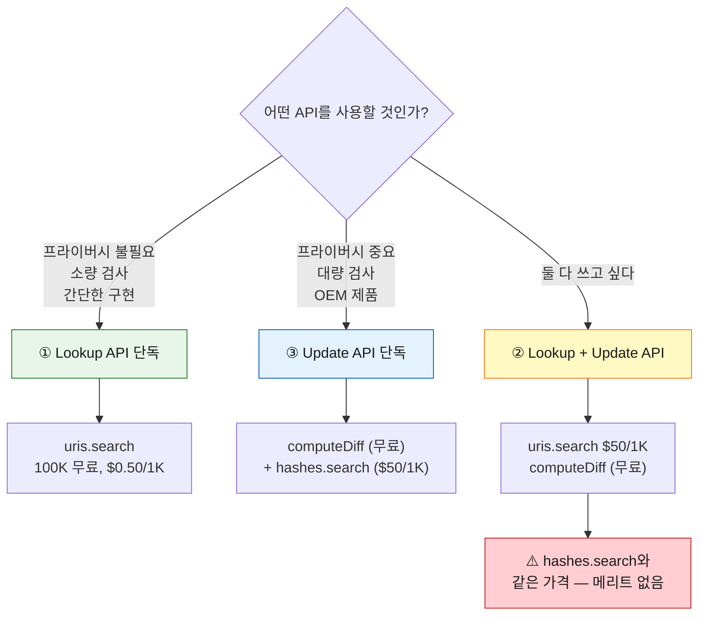

# Web Risk API 과금 구조 상세 분석

> Google Cloud Web Risk API의 4가지 과금 카테고리와 가격 정책의 설계 의도를 분석합니다.
>
> 참조: https://cloud.google.com/web-risk/pricing

---

## 목차

1. [4가지 과금 카테고리](#1-4가지-과금-카테고리)
2. [API 호출별 역할](#2-api-호출별-역할)
3. [왜 Lookup + Update API의 가격이 다른가?](#3-왜-lookup--update-api의-가격이-다른가)
4. [본 클라이언트의 과금 위치](#4-본-클라이언트의-과금-위치)
5. [비용 시뮬레이션](#5-비용-시뮬레이션)

---

## 1. 4가지 과금 카테고리

Google은 API 사용 패턴에 따라 **4가지 과금 카테고리**를 구분합니다:

| 카테고리 | 위협 확인 API | 로컬 DB 동기화 | 월 1~100K | 월 100K~10M | 월 10M+ |
|---------|-------------|--------------|----------|------------|--------|
| **① Lookup API** | `uris.search` | 없음 | **무료** | $0.50 / 1K | 영업팀 문의 |
| **② Lookup + Update API** | `uris.search` | `computeDiff` (무료) | $50 / 1K | 영업팀 문의 | — |
| **③ Update API** | `hashes.search` | `computeDiff` (무료) | $50 / 1K | 영업팀 문의 | — |
| **④ Submission API** | `submitUri` | — | 영업팀 문의 | — | — |

### 핵심 포인트

- `computeDiff`는 **항상 무료** (어떤 카테고리에서든)
- `computeDiff`를 **한 번이라도 호출하면**, `uris.search` 가격이 변경됨
- 유료 API는 `uris.search` 또는 `hashes.search` — **위협 확인** 단계에서만 비용 발생

---

## 2. API 호출별 역할

### `threatLists.computeDiff` — 로컬 DB 동기화

```
Google 서버 ──→ 클라이언트
(위협 해시 프리픽스를 로컬 SQLite에 동기화)
```

| 항목 | 내용 |
|-----|------|
| 역할 | 위협 목록의 해시 프리픽스(4바이트)를 로컬 DB에 동기화 |
| 비용 | **무료** (무제한) |
| 데이터 방향 | Google → 클라이언트 (다운로드) |
| 응답 형태 | RESET (전체 스냅샷) 또는 DIFF (증분 업데이트) |
| 프라이버시 | 영향 없음 (검사 URL과 무관) |

### `uris.search` — URL 직접 확인 (Lookup)

```
클라이언트 ──→ Google 서버
(검사할 URL 전체를 전송)
```

| 항목 | 내용 |
|-----|------|
| 역할 | URL을 Google에 보내서 위협 여부를 즉시 확인 |
| 비용 | 카테고리에 따라 다름 (아래 상세) |
| 데이터 방향 | 클라이언트 → Google (업로드) |
| 프라이버시 | **URL 전체가 Google에 노출** |
| 특징 | 로컬 DB 불필요, 간단한 구현 |

### `hashes.search` — 해시 프리픽스 확인 (Update)

```
클라이언트 ──→ Google 서버
(4바이트 해시 프리픽스만 전송)
```

| 항목 | 내용 |
|-----|------|
| 역할 | 로컬 매칭된 해시 프리픽스의 full hash 목록을 서버에서 받아 최종 확인 |
| 비용 | $50 / 1,000회 |
| 데이터 방향 | 클라이언트 → Google (4바이트만 전송) |
| 프라이버시 | **해시 프리픽스만 노출** (원본 URL 보호) |
| 특징 | 반드시 `computeDiff`로 로컬 DB 구축 필요 |

### `submitUri` — 의심 URL 제출

```
클라이언트 ──→ Google 서버
(의심 URL을 블록리스트에 추가 요청)
```

| 항목 | 내용 |
|-----|------|
| 역할 | 아직 목록에 없는 의심 URL을 Google에 제출하여 검토 요청 |
| 비용 | 영업팀 문의 |
| 사전 조건 | GCP 프로젝트 allowlist 등록 필요 |

---

## 3. 왜 Lookup + Update API의 가격이 다른가?

### 가격 비교

| 카테고리 | `uris.search` 가격 | 무료 구간 |
|---------|-------------------|----------|
| ① Lookup API (단독) | **$0.50** / 1K | 100K 무료 |
| ② Lookup + Update API | **$50** / 1K | 없음 |

**동일한 `uris.search` 호출**인데, `computeDiff`를 사용하느냐에 따라 가격이 **100배** 차이납니다.

### 이유: 차익거래(arbitrage) 방지

만약 하이브리드 카테고리에서도 `uris.search`가 $0.50/1K으로 유지된다면:

```
[차익거래 시나리오]

1. computeDiff로 로컬 DB 구축          → 무료
2. 검사할 URL의 hash prefix를 로컬 비교  → 무료 (코드 내 연산)
3. 로컬 매칭 안 됨 (99.997%)           → SAFE 확정, API 호출 0회
4. 로컬 매칭 됨 (0.003%)              → uris.search 호출 → $0.50/1K (저렴!)
```

이 구조의 문제점:

```
[기대 비용 비교]

• Lookup API만 사용:
  URL 100만건 검사 → uris.search 100만회 → $450 (100K 무료 + 900K × $0.50/1K)

• 하이브리드 (차익거래):
  URL 100만건 검사 → 로컬 필터로 99.997% 제거 → uris.search ~30회 → $0.015
                                                                    ^^^^^^^^
                                                               사실상 무료!
```

Google 입장에서 `hashes.search`($50/1K)의 수익이 완전히 무력화됩니다.

### Google의 해결책

> **`computeDiff`를 한 번이라도 호출하면, `uris.search` 가격을 $50/1K로 올린다.**

```
[차익거래 차단 후]

• Lookup API만: uris.search $0.50/1K (100K 무료)  → 저렴하지만 프라이버시 없음
• Update API만: hashes.search $50/1K               → 비싸지만 프라이버시 보호
• 하이브리드:   uris.search $50/1K (무료 구간 없음) → 메리트 없음!
```

결과적으로 사용자에게 **양자택일**을 강제합니다:



### 로컬 필터링이 차익거래가 되는 이유

로컬 DB의 해시 프리픽스(4바이트)만으로도 **안전한 URL은 100% 확실하게 걸러낼 수 있기 때문**입니다:

```
full_hash[:4] ≠ DB의 어떤 prefix  →  100% 안전 (false negative 없음)
full_hash[:4] = DB의 prefix       →  위협일 수도, 아닐 수도 (false positive 존재)
```

| 판정 | 확실성 | API 호출 필요 |
|-----|--------|-------------|
| **불일치 → SAFE** | **100% 확실** | 불필요 |
| 일치 → MAYBE | 불확실 (검증 필요) | `hashes.search` 또는 `uris.search` |

실제 로컬 DB를 기준으로 랜덤 URL이 매칭될 확률을 계산하면:

> **실측 데이터** (2026-03-06 sync 기준)
>
> | 위협 유형 | 프리픽스 수 |
> |---------|----------|
> | MALWARE | 10,024 |
> | SOCIAL_ENGINEERING | 65,536 |
> | UNWANTED_SOFTWARE | 33,212 |
> | **합계** | **108,772** |

$$P(\text{false positive}) = \frac{108{,}772}{2^{32}} \approx 0.0025\%$$

즉 **99.997%의 URL은 API 호출 없이 무료로 SAFE 판정** 가능합니다.
이것이 `computeDiff` 사용 시 `uris.search` 가격을 올려야 하는 결정적 이유입니다.

---

## 4. 본 클라이언트의 과금 위치

본 클라이언트(`webrisk_cli.py`)는 **③ Update API** 카테고리를 사용합니다:

| CLI 명령 | 사용 API | 과금 카테고리 | 비용 |
|---------|---------|------------|------|
| `sync` | `computeDiff` | ③ Update API | **무료** |
| `check` (로컬 매칭) | 없음 (코드 내 연산) | — | **무료** |
| `check` (매칭 시) | `hashes.search` | ③ Update API | **$50 / 1K회** |
| `submit` | `submitUri` | ④ Submission API | 영업팀 문의 |

### 로컬 DB 실측 데이터

실제 `sync` 명령 실행 시 출력 예시 (2026-03-06):

```
$ python webrisk_cli.py sync

  MALWARE:             DIFF | +48 -83   | total 10024
  SOCIAL_ENGINEERING:  DIFF | +1868 -1868 | total 65536
  UNWANTED_SOFTWARE:   DIFF | +77 -79   | total 33212
```

- **DIFF**: 증분 업데이트 (이전 동기화 이후 변경분만 수신)
- **+48 -83**: 프리픽스 48개 추가, 83개 제거
- **total 10,024**: 현재 로컬 DB에 저장된 해시 프리픽스 총 수
- 전체 프리픽스 합계: **108,772개** (3개 위협 유형 합산)

> 각 프리픽스는 4바이트이므로, 전체 DB 크기 ≈ 108,772 × 4B ≈ **425 KB**
> (SQLite 오버헤드 포함해도 수 MB 이내)

### 비용이 발생하는 지점

```
URL 입력
  ↓
[로컬 prefix 비교] ─── 불일치 (99.997%) ───→ SAFE (무료)
  │
  └── 일치 (0.003%) ───→ [hashes.search] ───→ 확정 ($50/1K)
```

> **대부분의 URL은 로컬 매칭에서 SAFE로 판정**되어 `hashes.search`까지 가지 않습니다.
> 따라서 실제 비용은 위협 URL을 검사하는 빈도에 비례하며, 일반적으로 매우 적습니다.

---

## 5. 비용 시뮬레이션

### 시나리오: 월 100만 URL 검사

#### ① Lookup API만 사용

```
uris.search 1,000,000회
  = 100,000회 (무료) + 900,000회 × $0.50/1K
  = $450/월
```

- 프라이버시: ❌ (모든 URL이 Google에 노출)
- 구현 복잡도: 낮음

#### ③ Update API 사용 (본 클라이언트)

```
computeDiff: 무료
  (실측: MALWARE 10,024 + SOCIAL_ENGINEERING 65,536 + UNWANTED_SOFTWARE 33,212
   = 총 108,772 프리픽스 동기화)

hashes.search:
  로컬 매칭률 ≈ 108,772 / 2³² ≈ 0.0025%
  → 1,000,000 × 0.000025 = ~25회
  25회 × ($50/1K) = $1.25/월
```

- 프라이버시: ✅ (해시 프리픽스만 전송)
- 구현 복잡도: 높음 (로컬 DB, 정규화, 해싱 필요)

#### 비용 비교 요약

| 방식 | 월 비용 | 프라이버시 | Google에 노출 |
|-----|--------|----------|-------------|
| Lookup API | ~$450 | ❌ | URL 전체 100만건 |
| **Update API** | **~$1.25** | ✅ | 해시 프리픽스 ~25건 |

> **360배의 비용 차이**가 발생하며, 프라이버시까지 보호됩니다.
> 이것이 OEM 제품이나 대량 검사 환경에서 Update API를 선택하는 이유입니다.

### 왜 하이브리드(②)는 의미가 없는가

```
Lookup + Update API:
  computeDiff: 무료
  로컬 필터로 99.997% 제거 → uris.search ~25회
  25회 × ($50/1K) = $1.25/월   ← hashes.search와 동일 가격!
```

같은 $1.50를 내면서 URL 전체를 Google에 보내야 하므로, 프라이버시만 손해입니다.
따라서 **하이브리드 카테고리는 실질적으로 선택할 이유가 없습니다.**

---

## 참조

- [Web Risk 가격 책정](https://cloud.google.com/web-risk/pricing)
- [Update API 가이드](https://cloud.google.com/web-risk/docs/update-api)
- [Lookup API 가이드](https://cloud.google.com/web-risk/docs/lookup-api)
