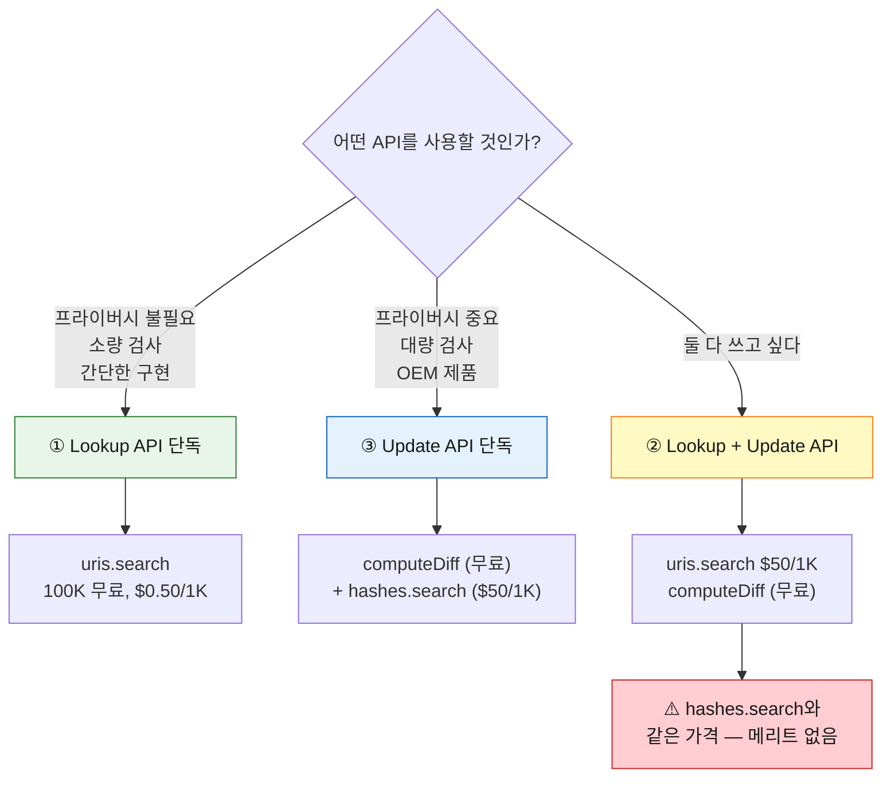
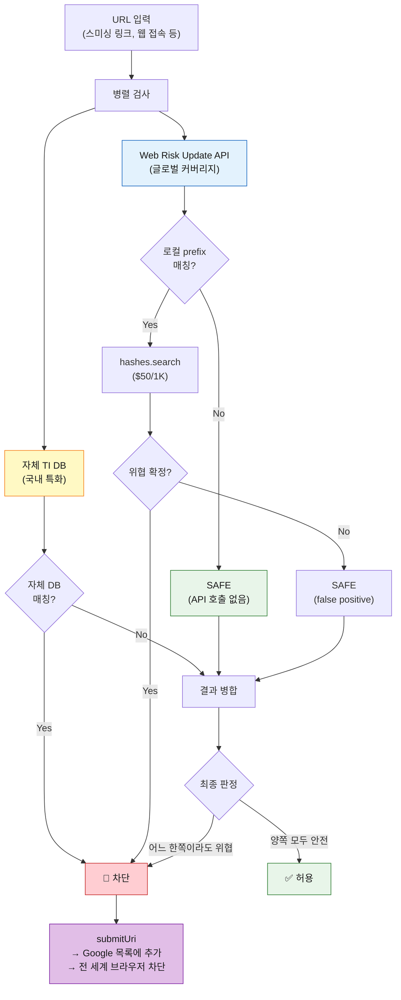
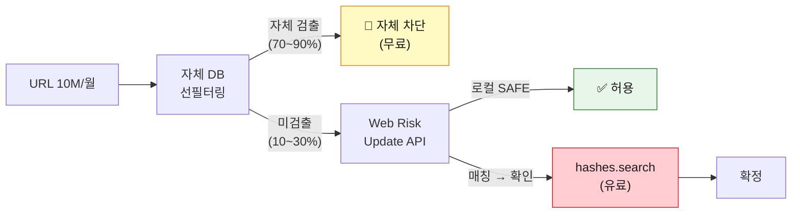
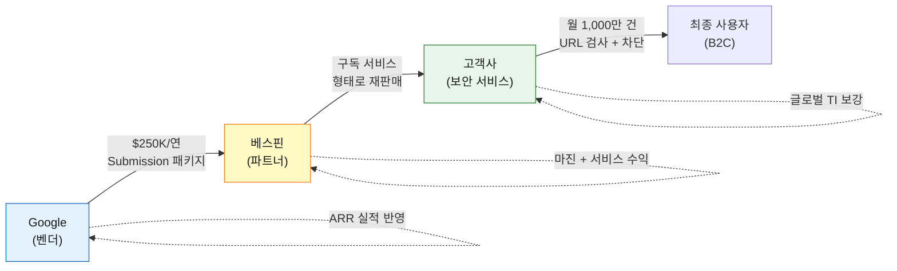
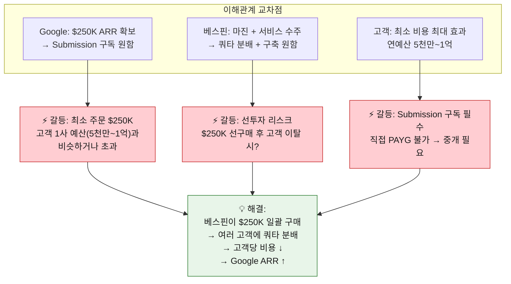
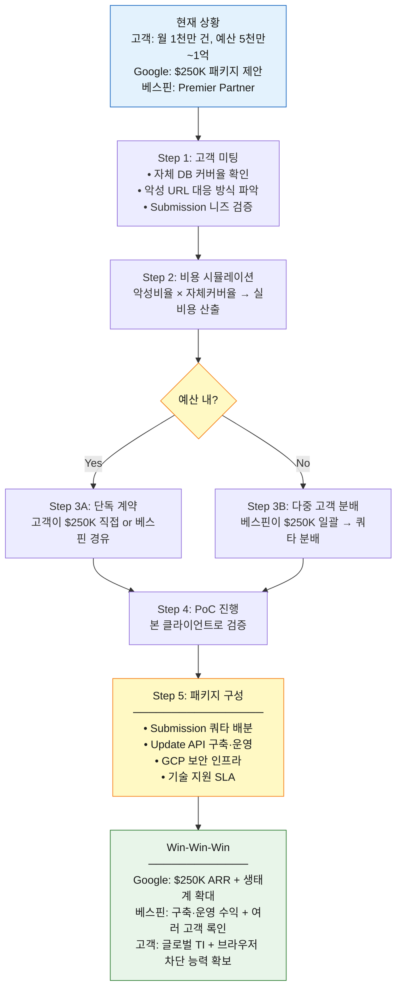

# Web Risk API 과금 구조 상세 분석

> Google Cloud Web Risk API의 4가지 과금 카테고리와 가격 정책의 설계 의도를 분석합니다.
>
> 참조: https://cloud.google.com/web-risk/pricing

---

## 목차

1. [4가지 과금 카테고리](#1-4가지-과금-카테고리)
2. [API 호출별 역할](#2-api-호출별-역할)
3. [왜 Lookup + Update API의 가격이 다른가?](#3-왜-lookup--update-api의-가격이-다른가)
4. [본 클라이언트의 과금 위치](#4-본-클라이언트의-과금-위치)
5. [비용 시뮬레이션](#5-비용-시뮬레이션)
6. [고객 시나리오: 보안 서비스 기업의 Web Risk 도입](#6-고객-시나리오-보안-서비스-기업의-web-risk-도입)
7. [이해관계자별 분석: 구글 · 베스핀 · 고객](#7-이해관계자별-분석-구글--베스핀--고객)

---

## 1. 4가지 과금 카테고리

Google은 API 사용 패턴에 따라 **4가지 과금 카테고리**를 구분합니다:

| 카테고리 | 위협 확인 API | 로컬 DB 동기화 | 월 1~100K | 월 100K~10M | 월 10M+ |
|---------|-------------|--------------|----------|------------|--------|
| **① Lookup API** | `uris.search` | 없음 | **무료** | $0.50 / 1K | 영업팀 문의 |
| **② Lookup + Update API** | `uris.search` | `computeDiff` (무료) | $50 / 1K | 영업팀 문의 | — |
| **③ Update API** | `hashes.search` | `computeDiff` (무료) | $50 / 1K | 영업팀 문의 | — |
| **④ Submission API** | `submitUri` | — | 영업팀 문의 | — | — |

### 핵심 포인트

- `computeDiff`는 **항상 무료** (어떤 카테고리에서든)
- `computeDiff`를 **한 번이라도 호출하면**, `uris.search` 가격이 변경됨
- 유료 API는 `uris.search` 또는 `hashes.search` — **위협 확인** 단계에서만 비용 발생

---

## 2. API 호출별 역할

### `threatLists.computeDiff` — 로컬 DB 동기화

```
Google 서버 ──→ 클라이언트
(위협 해시 프리픽스를 로컬 SQLite에 동기화)
```

| 항목 | 내용 |
|-----|------|
| 역할 | 위협 목록의 해시 프리픽스(4바이트)를 로컬 DB에 동기화 |
| 비용 | **무료** (무제한) |
| 데이터 방향 | Google → 클라이언트 (다운로드) |
| 응답 형태 | RESET (전체 스냅샷) 또는 DIFF (증분 업데이트) |
| 프라이버시 | 영향 없음 (검사 URL과 무관) |

### `uris.search` — URL 직접 확인 (Lookup)

```
클라이언트 ──→ Google 서버
(검사할 URL 전체를 전송)
```

| 항목 | 내용 |
|-----|------|
| 역할 | URL을 Google에 보내서 위협 여부를 즉시 확인 |
| 비용 | 카테고리에 따라 다름 (아래 상세) |
| 데이터 방향 | 클라이언트 → Google (업로드) |
| 프라이버시 | **URL 전체가 Google에 노출** |
| 특징 | 로컬 DB 불필요, 간단한 구현 |

### `hashes.search` — 해시 프리픽스 확인 (Update)

```
클라이언트 ──→ Google 서버
(4바이트 해시 프리픽스만 전송)
```

| 항목 | 내용 |
|-----|------|
| 역할 | 로컬 매칭된 해시 프리픽스의 full hash 목록을 서버에서 받아 최종 확인 |
| 비용 | $50 / 1,000회 |
| 데이터 방향 | 클라이언트 → Google (4바이트만 전송) |
| 프라이버시 | **해시 프리픽스만 노출** (원본 URL 보호) |
| 특징 | 반드시 `computeDiff`로 로컬 DB 구축 필요 |

### `submitUri` — 의심 URL 제출

```
클라이언트 ──→ Google 서버
(의심 URL을 블록리스트에 추가 요청)
```

| 항목 | 내용 |
|-----|------|
| 역할 | 아직 목록에 없는 의심 URL을 Google에 제출하여 검토 요청 |
| 비용 | 영업팀 문의 |
| 사전 조건 | GCP 프로젝트 allowlist 등록 필요 |

---

## 3. 왜 Lookup + Update API의 가격이 다른가?

### 가격 비교

| 카테고리 | `uris.search` 가격 | 무료 구간 |
|---------|-------------------|----------|
| ① Lookup API (단독) | **$0.50** / 1K | 100K 무료 |
| ② Lookup + Update API | **$50** / 1K | 없음 |

**동일한 `uris.search` 호출**인데, `computeDiff`를 사용하느냐에 따라 가격이 **100배** 차이납니다.

### 이유: 차익거래(arbitrage) 방지

만약 하이브리드 카테고리에서도 `uris.search`가 $0.50/1K으로 유지된다면:

```
[차익거래 시나리오]

1. computeDiff로 로컬 DB 구축          → 무료
2. 검사할 URL의 hash prefix를 로컬 비교  → 무료 (코드 내 연산)
3. 로컬 매칭 안 됨 (99.997%)           → SAFE 확정, API 호출 0회
4. 로컬 매칭 됨 (0.003%)              → uris.search 호출 → $0.50/1K (저렴!)
```

이 구조의 문제점:

```
[기대 비용 비교]

• Lookup API만 사용:
  URL 100만건 검사 → uris.search 100만회 → $450 (100K 무료 + 900K × $0.50/1K)

• 하이브리드 (차익거래):
  URL 100만건 검사 → 로컬 필터로 99.997% 제거 → uris.search ~30회 → $0.015
                                                                    ^^^^^^^^
                                                               사실상 무료!
```

Google 입장에서 `hashes.search`($50/1K)의 수익이 완전히 무력화됩니다.

### Google의 해결책

> **`computeDiff`를 한 번이라도 호출하면, `uris.search` 가격을 $50/1K로 올린다.**

```
[차익거래 차단 후]

• Lookup API만: uris.search $0.50/1K (100K 무료)  → 저렴하지만 프라이버시 없음
• Update API만: hashes.search $50/1K               → 비싸지만 프라이버시 보호
• 하이브리드:   uris.search $50/1K (무료 구간 없음) → 메리트 없음!
```

결과적으로 사용자에게 **양자택일**을 강제합니다:



### 로컬 필터링이 차익거래가 되는 이유

로컬 DB의 해시 프리픽스(4바이트)만으로도 **안전한 URL은 100% 확실하게 걸러낼 수 있기 때문**입니다:

```
full_hash[:4] ≠ DB의 어떤 prefix  →  100% 안전 (false negative 없음)
full_hash[:4] = DB의 prefix       →  위협일 수도, 아닐 수도 (false positive 존재)
```

| 판정 | 확실성 | API 호출 필요 |
|-----|--------|-------------|
| **불일치 → SAFE** | **100% 확실** | 불필요 |
| 일치 → MAYBE | 불확실 (검증 필요) | `hashes.search` 또는 `uris.search` |

실제 로컬 DB를 기준으로 랜덤 URL이 매칭될 확률을 계산하면:

> **실측 데이터** (2026-03-06 sync 기준)
>
> | 위협 유형 | 프리픽스 수 |
> |---------|----------|
> | MALWARE | 10,024 |
> | SOCIAL_ENGINEERING | 65,536 |
> | UNWANTED_SOFTWARE | 33,212 |
> | **합계** | **108,772** |

$$P(\text{false positive}) = \frac{108{,}772}{2^{32}} \approx 0.0025\%$$

즉 **99.997%의 URL은 API 호출 없이 무료로 SAFE 판정** 가능합니다.
이것이 `computeDiff` 사용 시 `uris.search` 가격을 올려야 하는 결정적 이유입니다.

---

## 4. 본 클라이언트의 과금 위치

본 클라이언트(`webrisk_cli.py`)는 **③ Update API** 카테고리를 사용합니다:

| CLI 명령 | 사용 API | 과금 카테고리 | 비용 |
|---------|---------|------------|------|
| `sync` | `computeDiff` | ③ Update API | **무료** |
| `check` (로컬 매칭) | 없음 (코드 내 연산) | — | **무료** |
| `check` (매칭 시) | `hashes.search` | ③ Update API | **$50 / 1K회** |
| `submit` | `submitUri` | ④ Submission API | 영업팀 문의 |

### 로컬 DB 실측 데이터

실제 `sync` 명령 실행 시 출력 예시 (2026-03-06):

```
$ python webrisk_cli.py sync

  MALWARE:             DIFF | +48 -83   | total 10024
  SOCIAL_ENGINEERING:  DIFF | +1868 -1868 | total 65536
  UNWANTED_SOFTWARE:   DIFF | +77 -79   | total 33212
```

- **DIFF**: 증분 업데이트 (이전 동기화 이후 변경분만 수신)
- **+48 -83**: 프리픽스 48개 추가, 83개 제거
- **total 10,024**: 현재 로컬 DB에 저장된 해시 프리픽스 총 수
- 전체 프리픽스 합계: **108,772개** (3개 위협 유형 합산)

> 각 프리픽스는 4바이트이므로, 전체 DB 크기 ≈ 108,772 × 4B ≈ **425 KB**
> (SQLite 오버헤드 포함해도 수 MB 이내)

### 비용이 발생하는 지점

```
URL 입력
  ↓
[로컬 prefix 비교] ─── 불일치 (99.997%) ───→ SAFE (무료)
  │
  └── 일치 (0.003%) ───→ [hashes.search] ───→ 확정 ($50/1K)
```

> **대부분의 URL은 로컬 매칭에서 SAFE로 판정**되어 `hashes.search`까지 가지 않습니다.
> 따라서 실제 비용은 위협 URL을 검사하는 빈도에 비례하며, 일반적으로 매우 적습니다.

---

## 5. 비용 시뮬레이션

### 시나리오: 월 100만 URL 검사

#### ① Lookup API만 사용

```
uris.search 1,000,000회
  = 100,000회 (무료) + 900,000회 × $0.50/1K
  = $450/월
```

- 프라이버시: ❌ (모든 URL이 Google에 노출)
- 구현 복잡도: 낮음

#### ③ Update API 사용 (본 클라이언트)

```
computeDiff: 무료
  (실측: MALWARE 10,024 + SOCIAL_ENGINEERING 65,536 + UNWANTED_SOFTWARE 33,212
   = 총 108,772 프리픽스 동기화)

hashes.search:
  로컬 매칭률 ≈ 108,772 / 2³² ≈ 0.0025%
  → 1,000,000 × 0.000025 = ~25회
  25회 × ($50/1K) = $1.25/월
```

- 프라이버시: ✅ (해시 프리픽스만 전송)
- 구현 복잡도: 높음 (로컬 DB, 정규화, 해싱 필요)

#### 비용 비교 요약

| 방식 | 월 비용 | 프라이버시 | Google에 노출 |
|-----|--------|----------|-------------|
| Lookup API | ~$450 | ❌ | URL 전체 100만건 |
| **Update API** | **~$1.25** | ✅ | 해시 프리픽스 ~25건 |

> **360배의 비용 차이**가 발생하며, 프라이버시까지 보호됩니다.
> 이것이 OEM 제품이나 대량 검사 환경에서 Update API를 선택하는 이유입니다.

### 왜 하이브리드(②)는 의미가 없는가

```
Lookup + Update API:
  computeDiff: 무료
  로컬 필터로 99.997% 제거 → uris.search ~25회
  25회 × ($50/1K) = $1.25/월   ← hashes.search와 동일 가격!
```

같은 $1.50를 내면서 URL 전체를 Google에 보내야 하므로, 프라이버시만 손해입니다.
따라서 **하이브리드 카테고리는 실질적으로 선택할 이유가 없습니다.**

---

## 6. 고객 시나리오: 보안 서비스 기업의 Web Risk 도입

### 고객사 현황

> 스미싱 차단, 자녀 보호, SNS 유해 콘텐츠 AI 판별, 유해 Web/App 차단 등
> **B2C 보안 서비스**를 제공하는 기업. 실시간 금융사기 방지가 핵심.

| 서비스 | 내용 | Web Risk 연관성 |
|--------|------|----------------|
| **스미싱 차단** | 악성 URL·피싱 번호 실시간 판별 → 개인정보·금융자산 보호 | ⭐ **핵심** — URL 위협 판정 |
| **자녀 보호 관리** | 위치 조회, 휴대폰·게임 사용시간 관리 | ◎ 유해 사이트 차단 시 활용 가능 |
| **SNS 콘텐츠 AI 판별** | 딥러닝 기반 유해 스트리밍·SNS 이미지 판별·차단 | △ 자체 AI 모델이 주력 |
| **유해 Web/App 차단** | 전문인력 + AI로 24시간 DB 최신화, 유해콘텐츠 차단 | ⭐ **핵심** — 자체 DB 보완 |

### Web Risk 도입 배경 분석

고객사가 이미 자체 DB와 AI를 보유하고 있음에도 Web Risk를 검토하는 이유:

```
[자체 TI(Threat Intelligence)의 한계]

  자체 DB          Google Web Risk
  ────────          ─────────────────
  ✅ 국내 특화       ✅ 글로벌 커버리지
  ✅ 고객 신고 기반   ✅ Google 검색엔진 크롤링 기반
  ⚠️ 신규 해외 위협 대응 지연   ✅ 실시간 글로벌 위협 업데이트
  ⚠️ DB 인력 24시간 운영 비용   ✅ 자동화된 위협 목록
  ❌ 커버리지 한계    ❌ 국내 특화 부족
```

> **결론**: 자체 DB를 대체하는 것이 아니라, **보완(supplement)** 관계.
> 국내 특화 DB(스미싱, 국내 피싱) + Google 글로벌 DB를 **병렬 검사**하는 구조가 최적.

### Submission API — 핵심 가치 제안

Google APAC 프리세일즈(Sherrie) 확인 사항:

> *"Update or lookup is actually not that important to them because they need to **block fraud sites**.
> And that is purely **submission API**."*

고객이 실시간 금융사기 방지 서비스를 제공한다면, **악성 URL을 발견했을 때
Google Safe Browsing 목록에 추가(submission)하여 전 세계 브라우저에서 즉시 차단**하는 것이
가장 큰 가치입니다.

| API | 역할 | 고객에게의 가치 |
|-----|------|----------------|
| `computeDiff` | 로컬 DB 동기화 | 빠른 1차 필터링 |
| `hashes.search` | 매칭 확인 | 위협 확정 |
| **`submitUri`** | **악성 URL을 Google 목록에 추가** | **⭐ 핵심 — 전 세계 브라우저에서 차단** |

#### 브라우저 전파 범위

Submission으로 등록된 악성 URL은 Safe Browsing을 내장한 브라우저에 전파됩니다:

| 브라우저 | Safe Browsing | 전파 지연 | 비고 |
|---------|-------------|---------|------|
| **Chrome** | ✅ 내장 | **즉시 ~ 30분** | Google 자체 브라우저 |
| **Samsung Internet** | ✅ 내장 | **즉시 ~ 30분** | Chromium 기반, Galaxy 기본 브라우저 |
| **기타 Chromium** | ✅ 내장 | **즉시 ~ 30분** | Brave, Opera, Vivaldi 등 |
| **Edge** | ✅ 내장 (지연) | **30분 ~ 1시간** | Microsoft가 별도 동기화 — 스텁번 |
| **Firefox** | ✅ 내장 | **~30분** | Google Safe Browsing 사용 |
| **Internet Explorer** | ❌ 미지원 | — | 기업 내부 네트워크 전용, URL 필터링으로 대체 |

> **핵심**: Submission 한 건으로 **Chrome + Samsung + Edge + Firefox** 등
> 전 세계 브라우저 사용자를 보호할 수 있으며, 이것은 **Google만 제공 가능**한 가치입니다.
>
> *"There is no competitor to this."* — Sherrie (Google APAC)

### 권장 아키텍처



### 악성 URL 비율별 비용 분석 (Update API)

비용은 **검사 대상 URL 중 실제 악성 비율**에 따라 크게 달라집니다.

- 일반 웹서핑 트래픽: 악성 비율 극히 낮음 → 대부분 로컬에서 SAFE
- 보안 서비스 의심 URL: 이미 필터링된 URL → 악성 비율 높음 (5~10%+)

#### 왜 악성 비율이 중요한가

```
[로컬 매칭 → hashes.search 호출 조건]

  실제 악성 URL → 로컬 DB에 prefix 100% 존재 → hashes.search 호출 (유료)
  정상 URL      → 우연 매칭 확률 0.0025%       → 거의 호출 없음 (무료)

  ∴ hashes.search 호출 수 ≈ (악성 URL 수) + (정상 URL × 0.0025%)
```

#### 월 1,000만 건 기준 — 악성 비율별 비용 시뮬레이션

| 악성 비율 | 악성 URL | 정상 URL | hashes.search 호출 | 월 비용 | **연 비용** | **연 비용 (KRW)** |
|---------|---------|---------|-------------------|--------|-----------|-----------------|
| **0.003%** (일반 웹서핑) | 300 | 9,999,700 | ~550 | $27.50 | **$330** | ≈ 45만원 |
| **0.1%** | 10,000 | 9,990,000 | ~10,250 | $512.50 | **$6,150** | ≈ 830만원 |
| **1%** | 100,000 | 9,900,000 | ~100,248 | $5,012 | **$60,150** | ≈ 8,120만원 |
| **5%** | 500,000 | 9,500,000 | ~500,238 | $25,012 | **$300,150** | ≈ 4.1억원 |
| **10%** (Google 추정) | 1,000,000 | 9,000,000 | ~1,000,225 | $50,011 | **$600,150** | ≈ 8.1억원 |
| **20%** | 2,000,000 | 8,000,000 | ~2,000,200 | $100,010 | **$1,200,150** | ≈ 16.2억원 |

> 환율: $1 = ₩1,350

<details>
<summary><b>산출 공식</b></summary>

```
월 검사량 = 10,000,000
악성 URL = 10,000,000 × 악성비율
정상 URL = 10,000,000 - 악성 URL
오탐 호출 = 정상 URL × 0.0025% (해시 프리픽스 우연 충돌)
총 호출 = 악성 URL + 오탐 호출
월 비용 = 총 호출 × ($50 / 1,000)
연 비용 = 월 비용 × 12
```
</details>

#### 비율별 연 비용 비교 차트

```
연 비용 (USD)
│
$1.2M ┤                                               ■ 20%
│                                               │
$600K ┤                                      ■ 10%   │
│                                      │        │
$300K ┤                            ■ 5%   │        │
│                            │        │        │
$60K  ┤               ■ 1%    │        │        │
│               │        │        │        │
$6K   ┤      ■ 0.1%  │        │        │        │
│      │        │        │        │        │
$330  ┤ ■ 0.003% │       │        │        │
└──────┬────────┬────────┬────────┬────────┬────→ 악성 비율
     0.003%   0.1%     1%       5%      10%     20%
```

#### 고객 유형별 추정 악성 비율

| 고객 유형 | 예상 악성 비율 | 설명 |
|---------|-------------|------|
| **일반 웹 프록시/게이트웨이** | 0.003% ~ 0.01% | 직원 웹서핑 전체 검사 |
| **ISP/통신사 DNS 필터링** | 0.01% ~ 0.1% | 가입자 DNS 쿼리 전체 |
| **이메일 보안 (URL 추출)** | 0.5% ~ 2% | 이메일 본문 URL 검사 |
| **스미싱 차단 서비스** | 1% ~ 5% | SMS/MMS 내 URL 검사 |
| **⭐ 금융사기 방지 (본 고객)** | **5% ~ 10%** | 의심 URL만 선별 검사 |
| **보안 SOC / IR 분석** | 10% ~ 30% | 이미 의심 확보된 IOC 검증 |

> **Google APAC 프리세일즈(Sherrie) 추정**: 본 고객의 경우 **~10%**
> → 연 **$600K (≈ 8.1억원)** — 고객 예산(5천만~1억원)을 **크게 초과**

### 비용 최적화 전략: 자체 DB 선필터링

고객이 자체 TI DB를 보유하고 있으므로, **자체 DB에서 먼저 검출한 URL은
Web Risk에 보내지 않는 구조**로 비용을 절감할 수 있습니다:



자체 DB가 악성 URL의 70~90%를 커버한다고 가정하면:

| 시나리오 | 자체 DB 커버 | WR로 넘어가는 악성 | hashes.search | 월 비용 | **연 비용** |
|---------|-----------|---------------|-------------|--------|-----------|
| 악성 10%, 자체 커버 0% | — | 1,000,000 | ~1,000,225 | $50,011 | **$600K** |
| 악성 10%, 자체 커버 50% | 500,000 | 500,000 | ~500,238 | $25,012 | **$300K** |
| 악성 10%, 자체 커버 70% | 700,000 | 300,000 | ~300,238 | $15,012 | **$180K** |
| 악성 10%, 자체 커버 90% | 900,000 | 100,000 | ~100,225 | $5,011 | **$60K** |
| 악성 10%, 자체 커버 95% | 950,000 | 50,000 | ~50,225 | $2,511 | **$30K** |

> **핵심**: 자체 DB 커버율이 높을수록 Web Risk 비용이 급감합니다.
> 고객이 이미 24시간 DB 운영 인력을 보유하고 있으므로,
> **자체 DB 90% 커버 시 연 ~$60K (≈ 8,100만원)** — 예산 범위 내.
> **자체 DB 95% 커버 시 연 ~$30K (≈ 4,050만원)** — 예산 하한 이내.

### 고객 예산 적합성 분석

고객 연예산: **5,000만원 ~ 1억원**

| 시나리오 | 연 비용 (KRW) | 예산 5천만원 대비 | 예산 1억원 대비 | 판정 |
|---------|-------------|--------------|-------------|------|
| 악성 0.003% (일반 트래픽) | ~45만원 | 0.9% | 0.5% | ✅ 여유 |
| 악성 1% | ~8,120만원 | 162% ❌ | 81% | ⚠️ 상한 내 |
| 악성 5% | ~4.1억원 | 820% ❌ | 410% ❌ | ❌ 초과 |
| 악성 10% (전량 WR 처리) | ~8.1억원 | 1,620% ❌ | 810% ❌ | ❌ 크게 초과 |
| **악성 10%, 자체 90% 커버** | **~8,100만원** | 162% | **81%** | **⚠️ 범위 내** |
| **악성 10%, 자체 95% 커버** | **~4,050만원** | **81%** | **41%** | **✅ 적합** |

> **결론**: Google 추정 악성 비율 10%에서, 자체 DB로 90~95%를 선처리하면
> Web Risk 비용을 **예산 범위 내**로 맞출 수 있습니다.
> 따라서 **고객 미팅에서 자체 DB 커버율 확인이 필수**입니다.

---

## 7. 이해관계자별 분석: 구글 · 베스핀 · 고객

### 배경

Google APAC 프리세일즈(Sherrie)와의 미팅에서 확인된 사항:

- Google 최소 주문 금액: **$250K/연** (Submission 10K건/월 포함)
- Submission은 Pay-As-You-Go 불가 → 반드시 구독 계약 필요
- Lookup/Update는 PAYG 가능 (100K/월 무료 후 종량제)
- 혼합 패키지($250K에 Submission + Lookup/Update 포함)는 **PM 승인 불확실**

### 구조 개요



### Google 입장

| 항목 | 분석 |
|-----|------|
| **제안 내용** | $250K/연 Submission 패키지 선구매 → 여러 고객사에 구독 판매 |
| **실제 의도** | 파트너 채널 통한 **선결제 실적 확보** (ARR 반영) |
| **최소 주문** | $250K — 이보다 적으면 PM이 PAYG로 안내 |
| **Google의 이점** | ① 선결제 매출 인식 ② 파트너 록인 ③ Safe Browsing 생태계 확대 |
| **핵심 메시지** | *"We're the only people that can do this"* — 경쟁자 없음을 강조 |

> **핵심**: Google은 Web Risk(특히 Submission)의 **독점적 가치**를 알고 있으며,
> $250K 최소 주문으로 의미 있는 ARR을 확보하려 합니다.
> 혼합 패키지를 원하면 PM 승인이 필요하므로, 초기에는 Submission 중심으로 접근이 현실적.

### 베스핀 입장

| 항목 | 분석 |
|-----|------|
| **역할** | Google Cloud Premier Partner → $250K 선구매 후 고객에게 재판매 |
| **수익 모델** | Submission 쿼타 리셀 + 구축·운영 서비스 + GCP 인프라 통합 |
| **리스크** | $250K 선구매 후 고객 이탈 시 재고 부담 |
| **기회** | Submission을 **"글로벌 브라우저 차단 서비스"**로 포장하여 고가치 판매 |

**수익 구조 분석:**

```
[베스핀 수익원]

1. Submission 쿼타 리셀
   $250K 구매 → 10K건/월 → 여러 고객에 분배
   ├─ 고객 A: 3K건/월 → 연 $75K 상당
   ├─ 고객 B: 3K건/월 → 연 $75K 상당
   └─ 고객 C: 4K건/월 → 연 $100K 상당
   마진: 고객 판매가 - $250K 매입가

2. Update API 구축·운영 (진짜 수익원)
   ├─ 구축 컨설팅: 아키텍처 설계·구현
   ├─ 기술 지원: 운영·모니터링·장애 대응 SLA
   ├─ GCP 인프라: Compute, Network, Monitoring 등
   └─ Update API 비용은 PAYG로 별도 (고객 직접 or 대행)

3. 부가 제안
   └─ Brand Protection (Proactive) — $1M 패키지, 금융권 대상
```

| 접근 방식 | 장단점 |
|---------|-------|
| **A. Submission 쿼타 리셀** | ✅ $250K → 여러 고객 분배로 마진 확보 가능 |
| **B. 구축·운영 서비스** | ✅ 기술력 기반 고마진, 고객 록인 |
| **C. GCP 통합 제안** | ✅ Web Risk를 미끼로 GCP 인프라 전체 수주 |

> **권장**: A + B + C 조합. Submission 쿼타를 여러 고객에 분배하면서,
> Update API 구축·운영 서비스와 GCP 인프라를 패키지로 판매.

### 고객 입장

| 항목 | 분석 |
|-----|------|
| **핵심 니즈** | ① 자체 TI 보완 (글로벌 커버리지) ② 발견한 악성 URL 즉시 차단 |
| **예산** | 연 5천만원~1억원 |
| **고려 사항** | 비용 효율, 서비스 안정성, 응답 속도 |

**고객이 알아야 할 것:**

| 팩트 | 설명 |
|-----|------|
| Update API 비용 | 악성 비율과 자체 DB 커버율에 따라 **연 $330~$600K** |
| Submission의 가치 | 발견한 악성 URL → **전 세계 브라우저에서 즉시 차단** → 이것이 진짜 가치 |
| 자체 DB 선필터링 | 자체 DB가 90%+ 커버하면 Update API 비용 예산 내 가능 |
| Submission은 PAYG 불가 | 반드시 $250K 구독 계약 필요 → 베스핀 통해 쿼타 분배가 유리할 수 있음 |
| 경쟁자 없음 | Google Safe Browsing은 브라우저 차단 분야에서 **유일한 솔루션** |

### 세 입장의 교차점과 갈등



### Google $250K/연 패키지 분석

| 포함 내용 | 수량 | 비고 |
|---------|------|------|
| **Submission** | 10,000건/월 | 연 120,000건 |
| Lookup (무료 구간) | 100,000건/월 | PAYG — 추가 시 $0.50/1K |
| Update (무료 구간) | 100,000건/월 | PAYG — 추가 시 $50/1K |

> **주의**: $250K에는 Submission만 포함. Lookup/Update 추가 비용은 별도.
> 혼합 패키지 가능 여부는 Google PM 승인 필요.

**$250K로 여러 고객 분배 시나리오:**

| 분배 | 고객 A | 고객 B | 고객 C | 총계 |
|-----|--------|--------|--------|------|
| Submission | 3,000건/월 | 3,000건/월 | 4,000건/월 | 10,000건/월 |
| 매출 배분 | ~$75K | ~$75K | ~$100K | $250K |
| 베스핀 마진 대상 | 구축·운영 | 구축·운영 | 구축·운영 | + 마진 |

### 종합 전략 권장



| 단계 | 행동 | 기대 효과 |
|-----|------|---------|
| **1. 고객 미팅** | 자체 DB 커버율, 악성 URL 대응 방식, Submission 니즈 확인 | 정확한 비용 산출 가능 |
| **2. 비용 산출** | 악성비율 × 자체커버율로 실제 hashes.search 호출 수 추정 | 예산 적합성 판단 |
| **3. 계약 구조** | 단독 or 다중 고객 분배 결정 | $250K 부담 분산 |
| **4. PoC** | 본 클라이언트로 실환경 검증 | 기술적 실현 가능성 입증 |
| **5. 패키지** | Submission + Update + 인프라 + SLA | 베스핀 수익 + 고객 가치 |

### 고객 미팅 시 확인 사항 (체크리스트)

Sherrie(Google)와의 미팅에서 도출된 필수 확인 항목:

| # | 질문 | 목적 |
|---|------|------|
| 1 | **주요 고객층이 누구인가?** (B2C 소비자 vs. B2B 기업) | B2C가 아니면 Safe Browsing 가치 낮음 |
| 2 | **악성 사이트 발견 시 현재 대응 방식은?** | Submission 니즈 검증 |
| 3 | **자체 DB의 악성 URL 커버율은?** | Update API 비용 산출의 핵심 변수 |
| 4 | **월 검사량 1,000만 건의 구성은?** (전수 검사 vs. 의심 URL만) | 악성 비율 추정 |
| 5 | **응답 속도 요구사항은?** (실시간 vs. 준실시간) | Lookup vs. Update 선택 |
| 6 | **기존 통신사/ISP와 협력 관계가 있는가?** | 있으면 Safe Browsing 가치 감소 |

---

## 참조

- [Web Risk 가격 책정](https://cloud.google.com/web-risk/pricing)
- [Update API 가이드](https://cloud.google.com/web-risk/docs/update-api)
- [Lookup API 가이드](https://cloud.google.com/web-risk/docs/lookup-api)
- [Submission API 가이드](https://cloud.google.com/web-risk/docs/submission-api)
