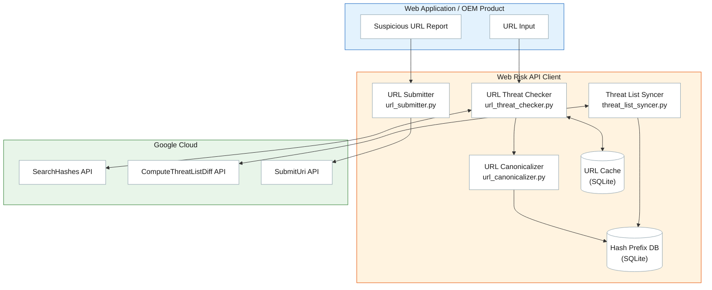
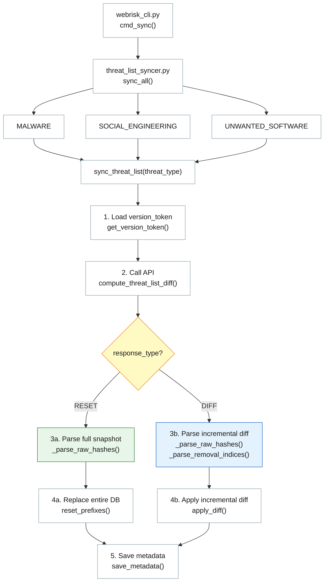
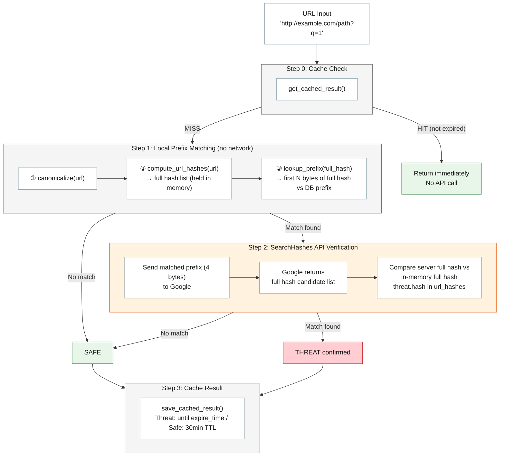
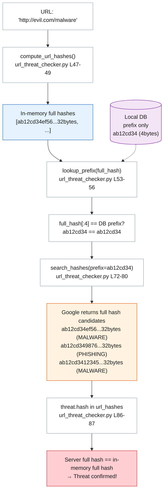
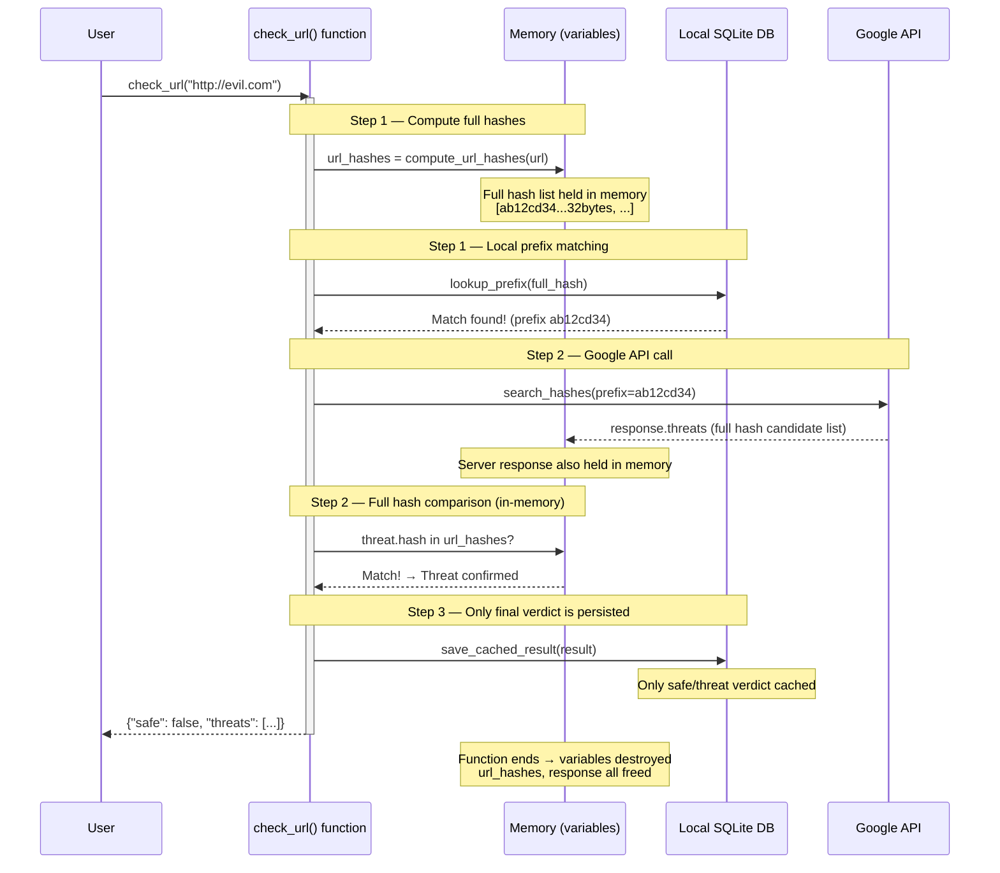
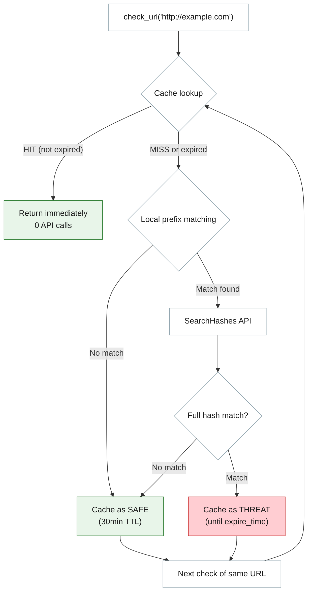
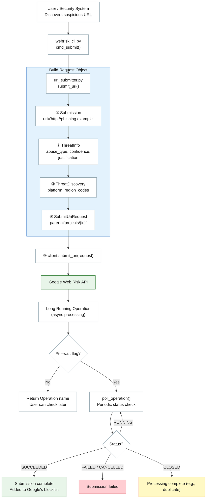
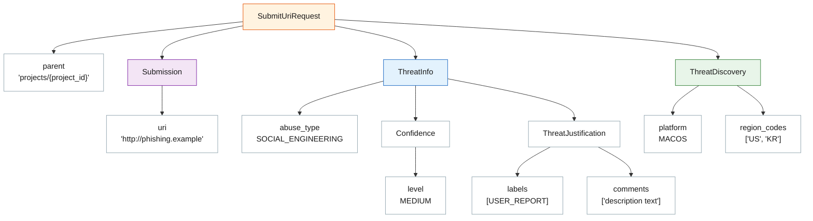
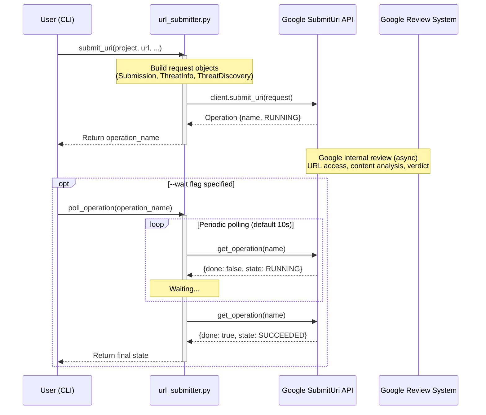

# Web Risk API — Workflow & Best Practice Guide

> Complete workflow documentation for the Google Cloud Web Risk API client.
> Covers function call sequences, data flows, and implementation details for each stage.

---

## Table of Contents

### Overview
1. [Architecture Overview](#1-architecture-overview) — System structure, API comparison

### Setup
2. [Prerequisites](#2-prerequisites) — GCP setup, Python environment

### Core Workflows
3. [Workflow 1 — Threat List Sync](#3-workflow-1--threat-list-sync) — Local DB update
4. [Workflow 2 — URL Threat Check](#4-workflow-2--url-threat-check) — 4-step threat detection

### Detailed Reference (Workflow 2 Internals)
5. [Workflow 3 — URL Canonicalization](#5-workflow-3--url-canonicalization)
6. [Workflow 4 — Suffix/Prefix Expression Generation](#6-workflow-4--suffixprefix-expression-generation)
7. [Workflow 5 — SHA-256 Hash Computation](#7-workflow-5--sha-256-hash-computation)

### Additional Features
8. [Workflow 6 — Caching](#8-workflow-6--caching) — URL check result cache
9. [Workflow 7 — Suspicious URL Submission (Submit URI)](#9-workflow-7--suspicious-url-submission-submit-uri) — Report threat URLs to Google

### Reference
10. [File Structure & Function Reference](#10-file-structure--function-reference)
11. [CLI Usage Examples](#11-cli-usage-examples)
12. [Best Practices](#12-best-practices)

---

## 1. Architecture Overview



### Why the Update API? (vs. Lookup API)

| Aspect | Lookup API | Update API |
|--------|-----------|------------|
| Method | `uris.search` — sends full URL | `hashes.search` — sends hash prefix only |
| Local DB | None | Synced via `computeDiff` (free) |
| Privacy | Checked URL exposed to Google | Only hash prefix sent (original URL protected) |
| Network | API call for every check | Most checks resolved locally (no API call on non-match) |
| Best for | Prototyping, low-volume checks | **OEM products, high-volume, privacy-critical environments** |

### What is the Submit URI API?

| Aspect | Update API (consume) | Submit URI API (contribute) |
|--------|---------------------|----------------------------|
| Data Direction | Google → Client (receive threat data) | Client → Google (submit suspicious URLs) |
| Purpose | **Check** if a URL is a threat | **Request addition** of a suspicious URL to Google's blocklist |
| Privacy | Only hash prefix sent | Full URL sent to Google |
| Response | Immediate result | Long Running Operation (async) |
| Prerequisite | API enablement only | **Project allowlist required** (contact sales) |
| Use Cases | Browser/email filters | Phishing report systems, security operations automation |

---

## 2. Prerequisites

### GCP Project Setup

```bash
# Enable the Web Risk API
gcloud services enable webrisk.googleapis.com

# Authentication (choose one)
# Option A: Service Account Key
export GOOGLE_APPLICATION_CREDENTIALS="/path/to/key.json"

# Option B: Application Default Credentials (development)
gcloud auth application-default login
```

### Python Environment

```bash
python -m venv .venv
source .venv/bin/activate
pip install google-cloud-webrisk
```

---

## 3. Workflow 1 — Threat List Sync

Synchronizes Google's threat hash prefixes into a local SQLite database.

### Overall Flow



### Step-by-Step Details

#### 3.1 Load version_token

```python
# threat_hash_store.py
version_token = threat_hash_store.get_version_token(threat_type_value)
# → First sync: b"" (empty bytes)
# → Subsequent syncs: previously saved version_token
```

The `version_token` identifies the current state of the local DB.
- **Empty**: No data exists, so the server returns a full snapshot (RESET)
- **Previous token**: Server returns only changes since that point (DIFF)

#### 3.2 ComputeThreatListDiff API Call

```python
# threat_list_syncer.py → sync_threat_list()
constraints = webrisk_v1.ComputeThreatListDiffRequest.Constraints(
    max_diff_entries=65536,         # Max addition/removal entries in DIFF response
    max_database_entries=262144,    # Max entries in local DB
    supported_compressions=[webrisk_v1.CompressionType.RAW],
)

request = webrisk_v1.ComputeThreatListDiffRequest(
    threat_type=threat_type,        # MALWARE / SOCIAL_ENGINEERING / UNWANTED_SOFTWARE
    version_token=version_token,    # Current state token
    constraints=constraints,
)

response = client.compute_threat_list_diff(request)
```

#### 3.3 Response Handling — RESET vs. DIFF

```python
# Branch based on response.response_type
```

**RESET (Full Snapshot)** — First sync or expired token:
```python
# 1. Parse hash prefixes from response
prefixes = _parse_raw_hashes(response.additions)
#   response.additions → ThreatEntryAdditions object (singular)
#   response.additions.raw_hashes → [RawHashes, ...] (repeated)
#   Each RawHashes: { prefix_size: 4, raw_hashes: b"\xab\xcd..." }
#   → Split by prefix_size to produce individual prefix list

# 2. Delete existing data and insert new data
threat_hash_store.reset_prefixes(threat_type, prefixes)
```

**DIFF (Incremental Update)** — Normal updates:
```python
# 1. Parse additions and removals
additions = _parse_raw_hashes(response.additions)
removals = _parse_removal_indices(response.removals)
#   removals: list of indices to delete from the sorted (ascending) prefix list

# 2. Remove by index, then add new prefixes
threat_hash_store.apply_diff(threat_type, additions, removals)
```

#### 3.4 Save Metadata

```python
# Save new version_token and recommended next sync time
threat_hash_store.save_metadata(
    threat_type_value,
    response.new_version_token,      # Token for next request
    response.recommended_next_diff,  # Recommended next sync time
)
```

> **Note**: `ComputeThreatListDiff` calls are **free** (unlimited).
> However, syncing before `recommended_next_diff` wastes bandwidth with no changes.
> The `should_sync()` function automatically checks this timing.

#### 3.5 Sync Output Example

```
[SYNC] Syncing MALWARE...
  -> RESET | +9839 -0 | total 9839
[SYNC] Syncing SOCIAL_ENGINEERING...
  -> RESET | +65536 -0 | total 65536
[SYNC] Syncing UNWANTED_SOFTWARE...
  -> RESET | +32880 -0 | total 32880
```

---

## 4. Workflow 2 — URL Threat Check

A 4-step workflow to check whether a URL is listed in any threat list.

### Overall Flow



### Step-by-Step Details

#### 4.0 Cache Check (Step 0)

```python
# url_threat_checker.py → check_url()
cached = threat_hash_store.get_cached_result(url)
# → Looks up url_check_cache table by SHA-256 of the URL
# → Returns cached result if expire_time has not passed
# → Deletes expired entries and returns None
```

#### 4.1 URL Canonicalization & Hash Generation (Step 1)

```python
# Canonicalize
canonical = url_canonicalizer.canonicalize(url)
# "HTTP://www.Example.com/a/../b" → "http://www.example.com/b"

# Generate suffix/prefix expressions → SHA-256 hash each
url_hashes = url_canonicalizer.compute_url_hashes(url)
# → Up to 30 SHA-256 hashes (32 bytes each)
```

#### 4.2 Local DB Prefix Matching (Step 1 continued)

```python
for full_hash in url_hashes:                    # e.g., 32-byte hash
    matched = threat_hash_store.lookup_prefix(full_hash)
    # full_hash[:prefix_len] == stored_prefix
    # prefix_len is the stored prefix length (typically 4 bytes)
```

Most URLs have **no match** here and are resolved as SAFE with no network call.

#### 4.3 SearchHashes API Verification (Step 2)

When a local match exists, it may be a false positive. The client fetches full hash candidates from Google for final verification.

```python
response = client.search_hashes(
    hash_prefix=full_hash[:4],                # 4-byte prefix
    threat_types=[MALWARE, SOCIAL_ENGINEERING, UNWANTED_SOFTWARE],
)

for threat in response.threats:
    if threat.hash in url_hashes:              # 32-byte full hash comparison
        # Confirmed threat!
        result["threats"].append({
            "threat_type": threat.threat_types[0].name,
            "expire_time": threat.expire_time,
        })
```

> **Privacy note**: Only a 4-byte hash prefix is sent to Google.
> The original URL cannot be reverse-engineered from this prefix.

#### 4.3.1 Full Hash Comparison — Where Does the "Local Full Hash" Come From?

> **Key insight**: The local DB does **not** store full hashes (32 bytes).
> The "local full hash" is **computed in real-time** from the URL being checked.

**Hash origin comparison:**

| Hash | Source | Size | Stored in DB? |
|------|--------|------|---------------|
| Local prefix | `ComputeThreatListDiff` API response → SQLite | 4–32 bytes | **Yes** |
| Local full hash | **Computed in real-time** from URL (`compute_url_hashes()`) | 32 bytes | No |
| Server full hash | `SearchHashes` API response (`threat.hash`) | 32 bytes | No |

**Flow with code locations:**



**Why this design?**

1. **Local DB stores only prefixes** — Google sends 4-byte prefixes, which alone cannot produce an exact match (false positives are possible).
2. **Full hash is computed from URL** — Canonicalize the URL → generate suffix/prefix expressions → SHA-256 produces 32-byte full hashes.
3. **SearchHashes API returns full hashes** — Google returns **all** threat full hashes matching the 4-byte prefix. **It does not make the verdict.**
4. **Final comparison is client-side** — If any server-returned full hash matches one we computed, the URL is a confirmed threat.

This design ensures only a 4-byte prefix is sent to Google, and the original URL is never exposed.

#### 4.3.2 Memory Lifecycle — When Is Hash Data Created and Destroyed?

Data held in memory during `check_url()` execution:



**Summary of in-memory data:**

| Data | Variable | Created At | Destroyed At | Persisted? |
|------|----------|-----------|-------------|-----------|
| URL full hash list | `url_hashes` | Step 1 (computed from URL) | Function exit | No |
| Local match result | `matched_hashes` | Step 1 (DB matching) | Function exit | No |
| Google API response (full hash candidates) | `response` | Step 2 (API call) | Function exit | No |
| Final verdict (safe/threat) | `result` | Step 2 (comparison done) | **Cached in DB** | Yes |

> **Key point**: Hash values themselves are never permanently stored.
> Only the **verdict** ("is this URL safe or a threat?") is persisted in the cache.
> On subsequent checks of the same URL, only the cached verdict is returned — no hash computation needed.

#### 4.4 Result Caching (Step 3)

```python
# Threat detected: cache until API's expire_time
# Safe verdict: 30-minute TTL (SAFE_URL_CACHE_TTL)
threat_hash_store.save_cached_result(url, is_safe, threats, expire)
```

---

## 5. Workflow 3 — URL Canonicalization

> This section details the internals of [Workflow 2 (Check)](#4-workflow-2--url-threat-check) **Step 1**.

URL canonicalization per Google's specification. Normalizes various URL forms pointing to the same webpage into a single standard representation.

> Reference: https://cloud.google.com/web-risk/docs/urls-hashing

### Processing Order (7 Steps)

```python
# url_canonicalizer.py → canonicalize()

# Step 1: Remove tab (0x09), CR (0x0D), LF (0x0A)
url = _remove_tab_cr_lf(url)
# "http://goo\tgle.com" → "http://google.com"

# Step 2: Remove fragment (#...)
url = url.split("#")[0]
# "http://google.com/page#section" → "http://google.com/page"

# Step 3: Repeatedly percent-unescape until stable
url = _unescape_until_stable(url)
# "http://example.com/%2541" → "%25" → "%" → "%41" → "A"
# i.e., fully decode multi-encoded URLs

# Step 4: Add scheme if missing
if not url.startswith(("http://", "https://")):
    url = "http://" + url

# Step 5: Normalize host (_normalize_host)
#   ① Strip leading/trailing dots, collapse consecutive dots
#   ② IDN (Internationalized Domain Name) → Punycode
#   ③ Convert to lowercase
#   ④ Normalize IP addresses (octal/hex/shorthand handling)

# Step 6: Normalize path (_normalize_path)
#   ① Resolve /../ and /./
#   ② Collapse consecutive slashes (//)

# Step 7: Percent-escape special characters
url = _percent_escape(url)
# ASCII ≤ 32, ≥ 127, '#', '%' → %XX (uppercase hex)
```

### Host Normalization Details (`_normalize_host`)

#### IDN (Internationalized Domain Name) → Punycode

```python
# "münchen.de" → "xn--mnchen-3ya.de"
host = host.encode("idna").decode("ascii")
```

Converts non-ASCII domains (Korean, German umlauts, etc.) to ASCII-compatible form.

#### IP Address Normalization (`_parse_ip_octal_hex`)

Normalizes various IP representations to standard dotted-decimal:

| Input Format | Example | Result |
|-------------|---------|--------|
| Standard 4-octet | `127.0.0.1` | `127.0.0.1` |
| Octal | `0177.0.0.01` | `127.0.0.1` |
| Hexadecimal | `0x7f.0x0.0x0.0x1` | `127.0.0.1` |
| 32-bit integer | `2130706433` | `127.0.0.1` |
| 3-component | `127.0.1` | `127.0.0.1` |
| Hex integer | `0x7f000001` | `127.0.0.1` |

```python
# _parse_ip_octal_hex() internal logic
parts = host.split(".")
# Parse each part: 0x → hex, leading 0 → octal, else → decimal

# Convert to 32-bit integer based on component count:
#   1 part:  entire value is 32-bit
#   2 parts: a.b → a is top 8 bits, b is lower 24 bits
#   3 parts: a.b.c → a.b is top 16 bits, c is lower 16 bits
#   4 parts: standard a.b.c.d

# struct.pack("!I", ip_int) → 4 bytes → dotted-decimal string
```

### Percent-Escape Details (`_percent_escape`)

Final canonicalization step — percent-encodes special characters:

```python
def _percent_escape(url: str) -> str:
    for char in url:
        code = ord(char)
        if code <= 32 or code >= 127 or char in ("#", "%"):
            # → "%XX" (uppercase hex)
            result.append(f"%{code:02X}")
```

| Target | Reason |
|--------|--------|
| ASCII ≤ 32 (space, control chars) | Not allowed in URLs |
| ASCII ≥ 127 (non-ASCII) | Encoded as UTF-8 bytes |
| `#` | Fragment separator |
| `%` | Prevents collision with existing escape sequences |

### Canonicalization Examples

| Input | Output |
|-------|--------|
| `HTTP://www.Example.com/` | `http://www.example.com/` |
| `http://google.com/a/../b` | `http://google.com/b` |
| `http://google.com/page#frag` | `http://google.com/page` |
| `http://goo\tgle.com/` | `http://google.com/` |
| `http://0177.0.0.01/` | `http://127.0.0.1/` |
| `http://example.com/über` | `http://example.com/%C3%BCber` |

---

## 6. Workflow 4 — Suffix/Prefix Expression Generation

> This section details the internals of [Workflow 2 (Check)](#4-workflow-2--url-threat-check) **Step 1**.

Generates **host suffix × path prefix** combinations from the canonicalized URL. Up to 30 total.

### Host Suffix Generation Rules (`_generate_host_suffixes`)

Up to **5** entries:
1. The exact hostname
2. Starting from the last 5 components, successively remove the leading component (up to 4 additional)

```
Example: a.b.c.d.e.f.g
  → a.b.c.d.e.f.g   (exact)
  → c.d.e.f.g        (last 5 components)
  → d.e.f.g
  → e.f.g
  → f.g
  ※ b.c.d.e.f.g is skipped (last-5 rule)
```

> **IP addresses**: Only the exact host (IP) is used; no additional suffixes are generated.

```python
# IP address detection
try:
    ipaddress.ip_address(host)
    return [host]  # No additional suffixes
except ValueError:
    pass  # It's a domain, proceed with suffix generation
```

### Path Prefix Generation Rules (`_generate_path_prefixes`)

Up to **6** entries:
1. Full path + query parameters
2. Full path (without query)
3. Starting from `/`, add path components one at a time (each with trailing `/`)

```
Example: /1/2/3.html?param=1
  → /1/2/3.html?param=1   (full + query)
  → /1/2/3.html            (full, no query)
  → /                       (root)
  → /1/
  → /1/2/
```

### Combination Examples

#### Example 1: `http://a.b.c/1/2.html?param=1`

```
Host suffixes: [a.b.c, b.c]
Path prefixes: [/1/2.html?param=1, /1/2.html, /, /1/]

Combinations (8):
  a.b.c/1/2.html?param=1
  a.b.c/1/2.html
  a.b.c/
  a.b.c/1/
  b.c/1/2.html?param=1
  b.c/1/2.html
  b.c/
  b.c/1/
```

#### Example 2: `http://a.b.c.d.e.f.g/1.html`

```
Host suffixes: [a.b.c.d.e.f.g, c.d.e.f.g, d.e.f.g, e.f.g, f.g]
Path prefixes: [/1.html, /]

Combinations (10):
  a.b.c.d.e.f.g/1.html
  a.b.c.d.e.f.g/
  c.d.e.f.g/1.html
  c.d.e.f.g/
  d.e.f.g/1.html
  d.e.f.g/
  e.f.g/1.html
  e.f.g/
  f.g/1.html
  f.g/
```

#### Example 3: `http://1.2.3.4/1/` (IP address)

```
Host suffixes: [1.2.3.4]  ← IP, no additional suffixes
Path prefixes: [/1/, /]

Combinations (2):
  1.2.3.4/1/
  1.2.3.4/
```

---

## 7. Workflow 5 — SHA-256 Hash Computation

> This section details the internals of [Workflow 2 (Check)](#4-workflow-2--url-threat-check) **Step 1**.

Each suffix/prefix expression is hashed with SHA-256.

```python
# url_canonicalizer.py → compute_url_hashes()
expressions = generate_url_expressions(url)
hashes = [hashlib.sha256(expr.encode("utf-8")).digest() for expr in expressions]
# → Each expression → UTF-8 bytes → SHA-256 → 32-byte digest
```

### Hash Prefix Matching

The local DB stores **4–32 byte hash prefixes** received from the API.
Matching compares the first N bytes of the full hash against the stored N-byte prefix.

```python
# threat_hash_store.py → lookup_prefix()
def lookup_prefix(hash_prefix: bytes) -> list[int]:
    for threat_type, stored_prefix in rows:
        prefix_len = len(stored_prefix)
        if hash_prefix[:prefix_len] == stored_prefix:
            matched.add(threat_type)
```

```
Full SHA-256 (32 bytes):  ba7816bf 8f01cfea 414140de 5dae2223 ...
DB Prefix (4 bytes):      ba7816bf
                          ^^^^^^^^
                          Only this part is compared
```

> **Note**: Prefix length is specified by Google's API in the `ComputeThreatListDiff` response's
> `prefix_size` field. The client does not choose this value.

---

## 8. Workflow 6 — Caching

Caches URL check results to prevent unnecessary API calls on repeated checks.

### Cache Table Schema

```sql
CREATE TABLE url_check_cache (
    url_sha256    BLOB    PRIMARY KEY,  -- SHA-256 of the URL (lookup key)
    url           TEXT    NOT NULL,     -- Original URL
    is_safe       INTEGER NOT NULL,     -- 1: safe, 0: threat
    threats_json  TEXT,                 -- Threat info JSON
    expire_time   TEXT    NOT NULL,     -- Expiration (ISO 8601)
    checked_at    TEXT    NOT NULL      -- Check timestamp
);
```

### Cache TTL Policy

| Result | TTL | Rationale |
|--------|-----|-----------|
| Threat detected | SearchHashes API's `expire_time` | Server-specified expiration |
| Safe | 30 minutes (`SAFE_URL_CACHE_TTL`) | Reasonable default |

### Cache Flow



---

## 9. Workflow 7 — Suspicious URL Submission (Submit URI)

Uses Google Web Risk's **SubmitUri API** to request addition of a suspicious URL to Google's Safe Browsing blocklist.

> **Prerequisite**: The SubmitUri API requires the GCP project to be on an **allowlist**.
> Contact your Google Cloud sales representative or Customer Engineer.

### Difference from the Update API

```
Update API (Workflows 1-6):
  Google ──→ Client     (consumes threat data)
  Direction: download / check

Submit URI (Workflow 7):
  Client ──→ Google     (contributes threat data)
  Direction: upload / report
```

- **Update API**: Syncs Google's threat lists locally, checks if a URL is listed
- **Submit URI**: Submits a URL not yet in the list for Google to review

### Overall Flow



### Step-by-Step Details

#### 9.1 Build Request Object

The SubmitUri API uses several nested protobuf messages:

```python
# url_submitter.py → submit_uri()

# ① Submission — the URL to submit
submission = webrisk_v1.Submission(uri="http://phishing.example")

# ② ThreatInfo — threat classification
threat_info = webrisk_v1.ThreatInfo(
    abuse_type=webrisk_v1.ThreatInfo.AbuseType.SOCIAL_ENGINEERING,
    threat_confidence=webrisk_v1.ThreatInfo.Confidence(
        level=webrisk_v1.ThreatInfo.Confidence.ConfidenceLevel.MEDIUM,
    ),
    threat_justification=webrisk_v1.ThreatInfo.ThreatJustification(
        labels=[JustificationLabel.USER_REPORT],
        comments=["Reported by end user via phishing button"],
    ),
)

# ③ ThreatDiscovery — discovery context (optional)
threat_discovery = webrisk_v1.ThreatDiscovery(
    platform=webrisk_v1.ThreatDiscovery.Platform.MACOS,
    region_codes=["US", "KR"],
)

# ④ SubmitUriRequest — final request
request = webrisk_v1.SubmitUriRequest(
    parent="projects/my-project-123",
    submission=submission,
    threat_info=threat_info,
    threat_discovery=threat_discovery,
)
```

#### 9.2 Request Object Structure



#### 9.3 Enum Reference

**AbuseType** (Threat Type):

| Value | Description |
|-------|-------------|
| `MALWARE` | Malicious software distribution |
| `SOCIAL_ENGINEERING` | Phishing and deceptive sites |
| `UNWANTED_SOFTWARE` | Unwanted software distribution |

> **Note**: `ThreatInfo.AbuseType` is a different enum from `ThreatType`.
> `SOCIAL_ENGINEERING_EXTENDED_COVERAGE` is not available in AbuseType.

**ConfidenceLevel**:

| Value | Description |
|-------|-------------|
| `LOW` | Automated detection, low certainty |
| `MEDIUM` | Automated detection + some manual review |
| `HIGH` | Manual verification completed, high certainty |

**JustificationLabel**:

| Value | Description |
|-------|-------------|
| `MANUAL_VERIFICATION` | Security expert manually confirmed |
| `USER_REPORT` | End user reported |
| `AUTOMATED_REPORT` | Automated system detected |

**Platform**:

| Value | Description |
|-------|-------------|
| `ANDROID` | Android environment |
| `IOS` | iOS environment |
| `MACOS` | macOS environment |
| `WINDOWS` | Windows environment |

#### 9.4 API Call and Long Running Operation

```python
# url_submitter.py → submit_uri()
client = webrisk_v1.WebRiskServiceClient()
operation = client.submit_uri(request=request)
# → operation.operation.name: "projects/{id}/operations/{op_id}"
```

SubmitUri returns a **Long Running Operation (LRO)**:
- Google may take minutes to hours to review the submitted URL
- Instead of returning an immediate result, it returns an Operation identifier for later status checks

#### 9.5 Operation Status Tracking

```python
# url_submitter.py → poll_operation()
# Periodically check the Operation status for completion

from google.api_core import operations_v1

ops_client = operations_v1.OperationsClient(transport.grpc_channel)
op = ops_client.get_operation(operation_name)

# op.done == True means processing is complete
# Check metadata for the final state
```

**Operation States:**

| State | Meaning |
|-------|---------|
| `RUNNING` | Google is reviewing the URL |
| `SUCCEEDED` | Review complete, added to blocklist |
| `FAILED` | Review failed (e.g., URL unreachable) |
| `CANCELLED` | Operation was cancelled |
| `CLOSED` | Processing finished (e.g., duplicate submission) |

#### 9.6 Operation Lifecycle



#### 9.7 Google's Best Practices for Submissions

| Recommendation | Description |
|----------------|-------------|
| **Set confidence accurately** | Use HIGH only when manually verified. Incorrect HIGH confidence causes false positives. |
| **Provide detailed justification** | Include both labels + comments for faster Google review. |
| **Avoid duplicate submissions** | Repeated submissions of the same URL may result in CLOSED status. |
| **Use region_codes** | Region-specific phishing (e.g., targeting Korea) benefits from explicit region codes. |
| **Specify platform** | Mobile-only phishing and platform-specific threats should include platform info. |
| **Account for async processing** | LRO does not complete immediately. Show "submitted" status in UX. |
| **Verify allowlist registration** | Confirm your project is on the allowlist before calling the API (403 error if not). |

---

## 10. File Structure & Function Reference

### `url_canonicalizer.py` — URL Canonicalization & Hashing

| Function | Description |
|----------|-------------|
| `canonicalize(url)` | 7-step URL canonicalization per Google spec |
| `_remove_tab_cr_lf(url)` | Remove tab, CR, LF characters |
| `_unescape_until_stable(url)` | Iterative percent-decode until stable |
| `_percent_escape(url)` | Percent-encode special characters (%XX) |
| `_normalize_host(host)` | Host normalization (dot handling, IDN→Punycode, IP normalization, lowercase) |
| `_parse_ip_octal_hex(host)` | Octal/hex/shorthand IP → dotted-decimal |
| `_normalize_path(path)` | Path normalization (/../, /./, // resolution) |
| `_generate_host_suffixes(host)` | Generate host suffixes (up to 5, excluding IPs) |
| `_generate_path_prefixes(path, query)` | Generate path prefixes (up to 6) |
| `generate_url_expressions(url)` | Generate suffix/prefix combinations (up to 30) |
| `compute_url_hashes(url)` | SHA-256 hash list for all expressions |

### `threat_hash_store.py` — SQLite DB Management

| Function | Description |
|----------|-------------|
| `init_db()` | Create tables (hash_prefixes, metadata, url_check_cache) |
| `get_version_token(threat_type)` | Return stored version_token |
| `save_metadata(threat_type, token, next_diff)` | Save/update metadata |
| `get_next_diff_time(threat_type)` | Query recommended next sync time |
| `reset_prefixes(threat_type, prefixes)` | RESET: full replacement |
| `apply_diff(threat_type, additions, removals)` | DIFF: incremental update |
| `lookup_prefix(hash_prefix)` | Local hash prefix matching |
| `get_prefix_count(threat_type)` | Count of stored prefixes |
| `get_cached_result(url)` | Cache lookup (auto-deletes expired entries) |
| `save_cached_result(url, is_safe, threats, expire)` | Save result to cache |
| `clear_cache()` | Clear entire cache |
| `purge_expired_cache()` | Delete only expired cache entries |
| `get_cache_count()` | Count of cache entries |

### `threat_list_syncer.py` — Threat List Synchronization

| Function | Description |
|----------|-------------|
| `sync_threat_list(threat_type, client)` | Sync a single threat type |
| `sync_all(client)` | Sync all threat types |
| `should_sync(threat_type)` | Check if sync is needed |
| `_parse_raw_hashes(additions)` | Parse API response → prefix list |
| `_parse_removal_indices(removals)` | Parse API response → removal indices |

### `url_threat_checker.py` — URL Threat Checking

| Function | Description |
|----------|-------------|
| `check_url(url, client, use_cache, verbose)` | 4-step URL check (cache → local → API → cache store) |

### `url_submitter.py` — Suspicious URL Submission

| Function | Description |
|----------|-------------|
| `submit_uri(project_id, uri, ...)` | Submit suspicious URL to Google (returns LRO) |
| `poll_operation(operation_name, ...)` | Periodically poll LRO status until completion |
| `_get_state_from_metadata(metadata_any)` | Extract state string from Operation metadata |

**`submit_uri()` Parameters:**

| Parameter | Type | Required | Default | Description |
|-----------|------|----------|---------|-------------|
| `project_id` | `str` | ✅ | — | GCP project ID |
| `uri` | `str` | ✅ | — | Suspicious URL to submit |
| `threat_type` | `str` | — | `"SOCIAL_ENGINEERING"` | Threat type |
| `confidence` | `str` | — | `"MEDIUM"` | Confidence level |
| `justification_labels` | `list[str]` | — | `None` | Justification labels |
| `justification_comments` | `list[str]` | — | `None` | Free-form description |
| `platform` | `str` | — | `None` | Discovery platform |
| `region_codes` | `list[str]` | — | `None` | ISO 3166-1 alpha-2 region codes |
| `verbose` | `bool` | — | `False` | Verbose output |

### `webrisk_cli.py` — CLI Interface

| Command | Function | Description |
|---------|----------|-------------|
| `sync [-f]` | `cmd_sync()` | Sync threat lists (`-f`: force full reset) |
| `check [-v] URL` | `cmd_check()` | Check URL for threats (`-v`: verbose output) |
| `status` | `cmd_status()` | Show local DB status |
| `cache-clear` | `cmd_cache_clear()` | Clear all URL check cache |
| `submit URL --project ID [options]` | `cmd_submit()` | Submit suspicious URL |

---

## 11. CLI Usage Examples

### Initial Sync

```bash
$ python webrisk_cli.py sync -f

Starting full forced sync...

[SYNC] Syncing MALWARE...
  -> RESET | +9839 -0 | total 9839
[SYNC] Syncing SOCIAL_ENGINEERING...
  -> RESET | +65536 -0 | total 65536
[SYNC] Syncing UNWANTED_SOFTWARE...
  -> RESET | +32880 -0 | total 32880

Sync complete.
```

### URL Check (Verbose Mode)

```bash
$ python webrisk_cli.py check -v "http://example.com/path?q=test"

Checking: http://example.com/path?q=test

  [Step 0] Checking cache...
  [Step 0] Cache MISS
  [Step 1] Canonicalized URL: http://example.com/path?q=test
  [Step 1] Generated 6 hash expressions
  [Step 1] Local prefix matches: 0/6
  [Step 1] No local match -> SAFE
  [Step 3] Result cached (TTL: 0:30:00)

  Safe - no threats detected.
```

### URL Check (Cache HIT)

```bash
$ python webrisk_cli.py check -v "http://example.com/path?q=test"

Checking: http://example.com/path?q=test

  [Step 0] Checking cache...
  [Step 0] Cache HIT (expires: 2026-03-06T15:30:00+00:00)

  (result from cache)
  Safe - no threats detected.
```

### Threat Detected

```bash
$ python webrisk_cli.py check -v "http://malicious-site.example"

Checking: http://malicious-site.example

  [Step 0] Checking cache...
  [Step 0] Cache MISS
  [Step 1] Canonicalized URL: http://malicious-site.example/
  [Step 1] Generated 4 hash expressions
  [Step 1] Local prefix matches: 1/4
  [Step 2] Sending hash prefix a1b2c3d4 to Google SearchHashes API...
  [Step 2] Received 3 threat entries from Google
  [Step 2] THREAT DETECTED: 1 match(es)
  [Step 3] Result cached until 2026-03-07T00:00:00+00:00

  Threat detected!
    - MALWARE (expires: 2026-03-07T00:00:00+00:00)
```

### DB Status

```bash
$ python webrisk_cli.py status

=== Local DB Status ===

  MALWARE:
    hash prefixes  : 9,839
    version_token  : a1b2c3d4e5f6...
    next diff time : 2026-03-06T12:30:00+00:00

  SOCIAL_ENGINEERING:
    hash prefixes  : 65,536
    version_token  : f6e5d4c3b2a1...
    next diff time : 2026-03-06T12:30:00+00:00

  UNWANTED_SOFTWARE:
    hash prefixes  : 32,880
    version_token  : 1a2b3c4d5e6f...
    next diff time : 2026-03-06T12:30:00+00:00

  URL check cache  : 42 entries
```

### Submit Suspicious URL (Basic)

```bash
$ python webrisk_cli.py submit "http://phishing.example/login" \
    --project my-project-123 \
    --type SOCIAL_ENGINEERING \
    --confidence MEDIUM

Submitting: http://phishing.example/login
  Threat type : SOCIAL_ENGINEERING
  Confidence  : MEDIUM

  Submission accepted!
  Operation: projects/my-project-123/operations/abc123def456
```

### Submit Suspicious URL (Full Options + Wait)

```bash
$ python webrisk_cli.py submit "http://malware-drop.example/payload.exe" \
    --project my-project-123 \
    --type MALWARE \
    --confidence HIGH \
    --justification "MANUAL_VERIFICATION,USER_REPORT" \
    --comment "Confirmed malware dropper by security team" \
    --platform WINDOWS \
    --region "US,KR" \
    --wait \
    --timeout 300 \
    --interval 15 \
    -v

Submitting: http://malware-drop.example/payload.exe
  Threat type : MALWARE
  Confidence  : HIGH
  Justification: MANUAL_VERIFICATION, USER_REPORT
  Comment     : Confirmed malware dropper by security team
  Platform    : WINDOWS
  Regions     : US, KR

  [Submit] URI: http://malware-drop.example/payload.exe
  [Submit] Threat type: MALWARE
  [Submit] Confidence: HIGH
  [Submit] Justification labels: ['MANUAL_VERIFICATION', 'USER_REPORT']
  [Submit] Justification comments: ['Confirmed malware dropper by security team']
  [Submit] Platform: WINDOWS
  [Submit] Region codes: ['US', 'KR']
  [Submit] Built Submission object
  [Submit] Built ThreatInfo object
  [Submit] Built ThreatDiscovery object
  [Submit] Built SubmitUriRequest (parent=projects/my-project-123)
  [Submit] Calling SubmitUri API...
  [Submit] Operation started: projects/my-project-123/operations/xyz789

  Submission accepted!
  Operation: projects/my-project-123/operations/xyz789

  Waiting for Google to process (timeout: 300s)...
  [Poll] Polling operation: projects/my-project-123/operations/xyz789
  [Poll] Timeout: 300s, interval: 15s
  [Poll] State: RUNNING ... (elapsed 0s)
  [Poll] State: RUNNING ... (elapsed 15s)
  [Poll] Operation completed. State: SUCCEEDED

  Final state: SUCCEEDED
```

---

## 12. Best Practices

### Synchronization

| Practice | Description |
|----------|-------------|
| **Respect `recommended_next_diff`** | Although `computeDiff` is free, requesting before the recommended time wastes bandwidth with no new changes. |
| **Preserve version_token** | Losing the token triggers a full RESET, wasting bandwidth. |
| **Schedule periodic syncs** | Use cron or a scheduler to run `sync` automatically. |
| **Prepare for RESET on DIFF failure** | If the token expires, the server automatically returns a RESET response. |

### Threat Checking

| Practice | Description |
|----------|-------------|
| **Leverage caching** | For repeated URL checks, `use_cache=True` (default) reduces costly SearchHashes calls. |
| **Sync before checking** | If the local DB is empty when checking, `sync_all()` is called automatically. |
| **Minimize SearchHashes calls** | Most URLs are resolved as SAFE at the local matching stage. Paid SearchHashes calls are rare. |

### URL Canonicalization

| Practice | Description |
|----------|-------------|
| **Follow canonicalization order** | Tab/CR removal → fragment removal → unescape → host/path normalization → percent-escape |
| **Handle IP addresses** | Convert all octal, hex, and shorthand IPs to dotted-decimal. |
| **IDN domains** | Convert internationalized domain names to Punycode for consistent matching. |
| **Exclude IPs from suffix generation** | IP addresses do not produce host suffixes (per Google spec). |

### Operations

| Practice | Description |
|----------|-------------|
| **Back up DB file** | Periodically back up `webrisk_local.db` (preserves version_token). |
| **Add DB to `.gitignore`** | Do not commit `webrisk_local.db` to Git. |
| **Prune cache** | Use `cache-clear` or `purge_expired_cache()` to clean up expired entries. |
| **Error handling** | SearchHashes failures due to network errors are handled gracefully. |

### Submit URI

| Practice | Description |
|----------|-------------|
| **Verify allowlist registration** | Confirm your GCP project is on the SubmitUri allowlist before calling. Without it, you get `403 PERMISSION_DENIED`. |
| **Set confidence accurately** | Use `HIGH` only after manual verification. Incorrect confidence causes false positives. |
| **Provide detailed justification** | Include both `labels` + `comments` for faster Google review. |
| **Avoid duplicate submissions** | Repeated submissions of the same URL may result in `CLOSED` status. |
| **Use region_codes** | Region-specific phishing (e.g., targeting Korea) benefits from explicit region codes. |
| **Specify platform** | Mobile-only phishing and platform-specific threats should include platform info. |
| **Account for async LRO** | `submit_uri()` does not complete immediately. Show a "submitted" status in your UX. |
| **Set appropriate timeout** | When using `--wait`, set a reasonable `--timeout`. Google review can take minutes to hours. |

---

## References

- [Google Web Risk API Documentation](https://cloud.google.com/web-risk/docs)
- [Update API Guide](https://cloud.google.com/web-risk/docs/update-api)
- [Submit URI Guide](https://cloud.google.com/web-risk/docs/submit-uri)
- [URL Canonicalization & Hashing Spec](https://cloud.google.com/web-risk/docs/urls-hashing)
- [ComputeThreatListDiff RPC](https://cloud.google.com/web-risk/docs/reference/rpc/google.cloud.webrisk.v1#computethreatlistdiffrequest)
- [SearchHashes RPC](https://cloud.google.com/web-risk/docs/reference/rpc/google.cloud.webrisk.v1#searchhashesrequest)
- [SubmitUri RPC](https://cloud.google.com/web-risk/docs/reference/rpc/google.cloud.webrisk.v1#submituriRequest)
