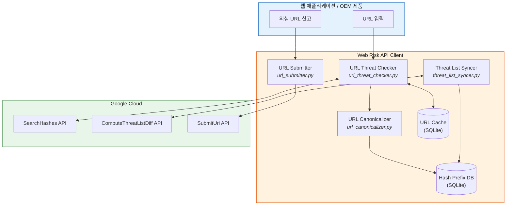
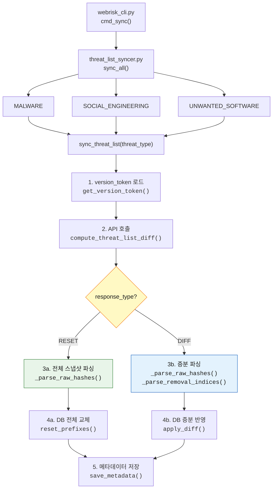
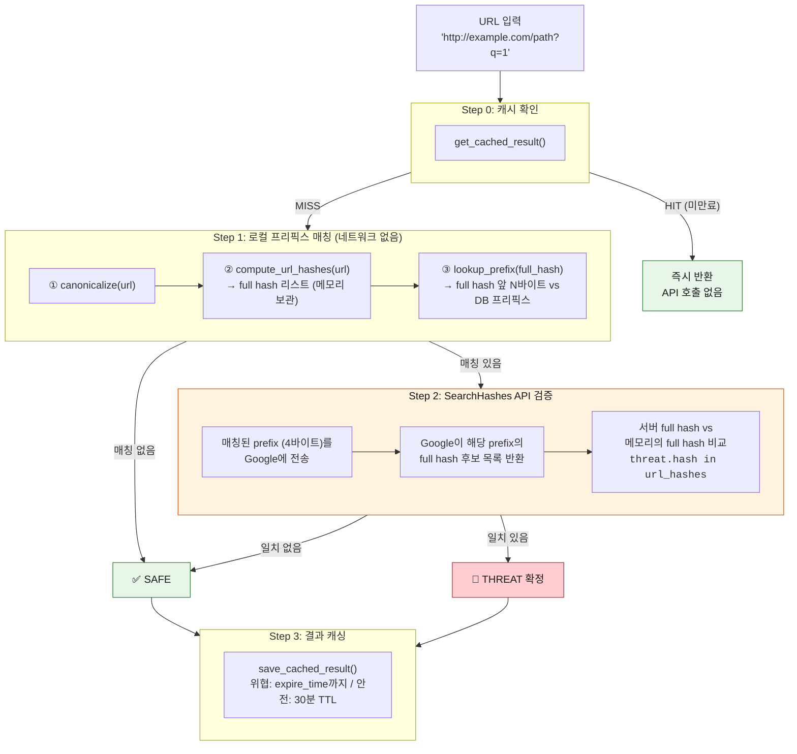
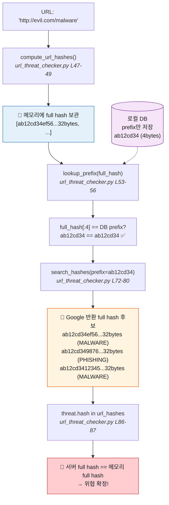
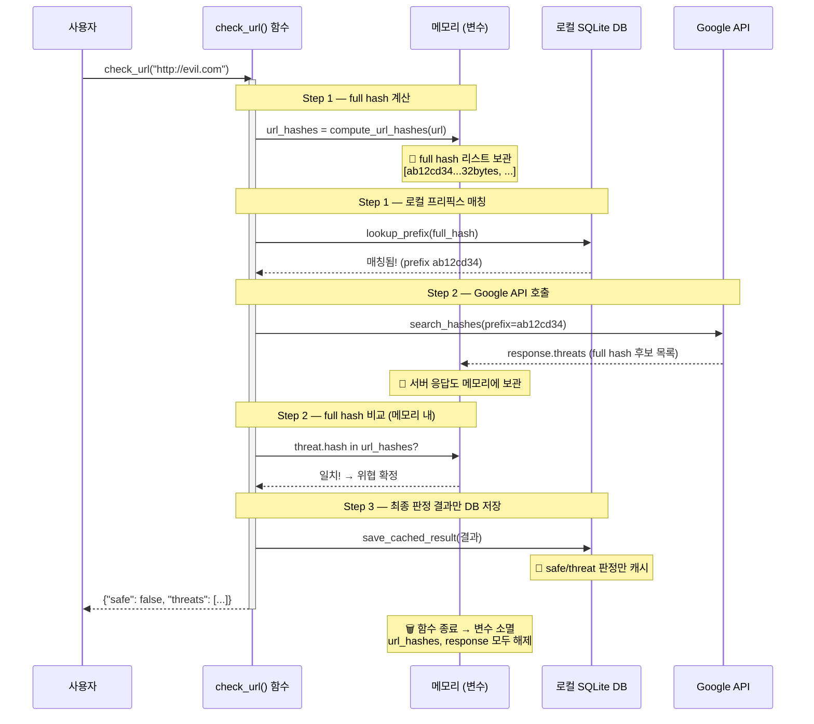
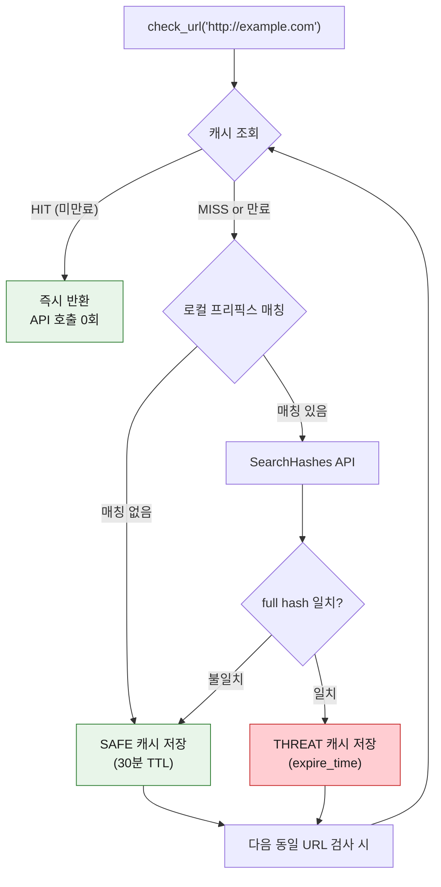
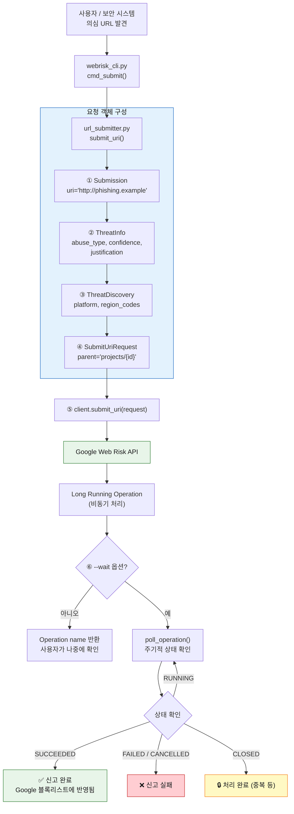
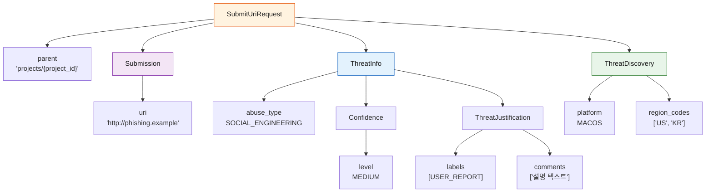
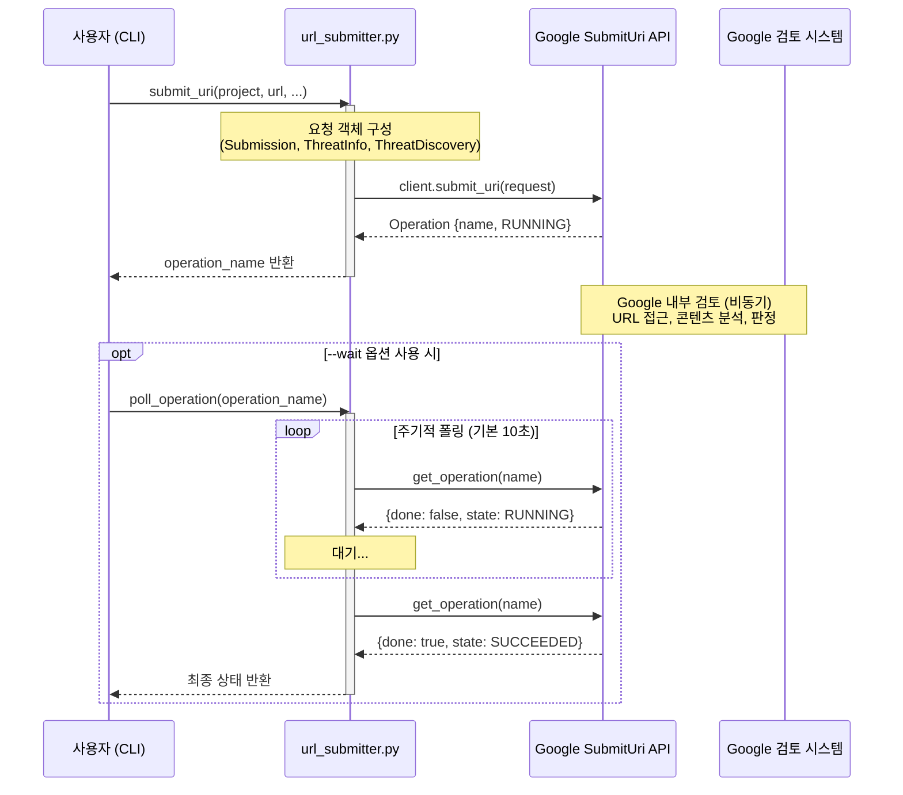

# Web Risk API — Workflow & Best Practice Guide

> Google Cloud Web Risk API를 활용한 URL 위협 검사 및 신고 클라이언트의 전체 워크플로우를 설명합니다.
> 각 단계별 함수 호출, 데이터 흐름, 구현 세부사항을 포함합니다.

---

## 목차

### 개요
1. [아키텍처 개요](#1-아키텍처-개요) — 시스템 구조, API 비교, 과금

### 준비
2. [사전 준비](#2-사전-준비) — GCP 설정, Python 환경

### 핵심 워크플로우
3. [Workflow 1 — Threat List 동기화 (Sync)](#3-workflow-1--threat-list-동기화-sync) — 로컬 DB 업데이트
4. [Workflow 2 — URL 위협 검사 (Check)](#4-workflow-2--url-위협-검사-check) — 4단계 위협 판정

### 상세 참조 (Workflow 2의 내부 동작)
5. [Workflow 3 — URL 정규화 (Canonicalization)](#5-workflow-3--url-정규화-canonicalization)
6. [Workflow 4 — Suffix/Prefix Expression 생성](#6-workflow-4--suffixprefix-expression-생성)
7. [Workflow 5 — SHA-256 해시 계산](#7-workflow-5--sha-256-해시-계산)

### 부가 기능
8. [Workflow 6 — 캐싱](#8-workflow-6--캐싱) — URL 검사 결과 캐시
9. [Workflow 7 — 의심 URL 신고 (Submit URI)](#9-workflow-7--의심-url-신고-submit-uri) — Google에 위협 URL 제출

### 레퍼런스
10. [파일 구조 & 함수 참조](#10-파일-구조--함수-참조)
11. [CLI 사용 예시](#11-cli-사용-예시)
12. [Best Practices](#12-best-practices)

---

## 1. 아키텍처 개요



### 왜 Update API인가? (vs Lookup API)

| 항목 | Lookup API (`uris.search`) | Update API (`ComputeThreatListDiff` + `SearchHashes`) |
|-----|---------------------------|------------------------------------------------------|
| 동작 방식 | URL을 Google 서버로 직접 전송 | 로컬 DB에서 1차 매칭 후, 매칭된 해시만 서버로 전송 |
| 프라이버시 | Google에 검사 URL 노출 | 해시 프리픽스만 전송 (원본 URL 보호) |
| 네트워크 | 매 검사마다 API 호출 | 대부분 로컬에서 처리 (비매칭 시 API 호출 없음) |
| 비용 | 호출 건수에 비례 ($0.50/1K) | 동기화 **무료** + SearchHashes ($50/1K) |
| 적합 대상 | 프로토타입, 소량 검사 | **OEM 제품, 대량 검사, 프라이버시 중요 환경** |

### Submit URI API란?

| 항목 | Update API (소비) | Submit URI API (기여) |
|-----|-------------------|----------------------|
| 데이터 방향 | Google → 클라이언트 (위협 데이터 수신) | 클라이언트 → Google (의심 URL 제출) |
| 목적 | URL이 위협인지 **검사** | 의심 URL을 Google 블록리스트에 **추가 요청** |
| 프라이버시 | 해시 프리픽스만 전송 | URL 전체를 Google에 전송 |
| 응답 | 즉시 결과 반환 | Long Running Operation (비동기) |
| 사전 조건 | API 활성화만 필요 | **프로젝트 allowlist 필요** (영업팀 연락) |
| 사용 예 | 브라우저/메일 필터 | 피싱 신고 시스템, 보안 운영 자동화 |

### API 과금 구조

> 참조: https://cloud.google.com/web-risk/pricing

| API 호출 | 과금 | 비고 |
|---------|------|------|
| `threatLists.computeDiff` (동기화) | **무료** (무제한) | 로컬 DB 업데이트 |
| `hashes.search` (SearchHashes) | **$50 / 1,000회** | 로컬 매칭 후 full hash 검증 시에만 호출 |
| `uris.search` (Lookup API) | 100K 무료, 이후 $0.50/1K | 본 클라이언트는 사용하지 않음 |
| `SubmitUri` (URL 신고) | 별도 문의 | Google 영업팀에 문의 |

> **핵심**: 동기화(`sync`)는 아무리 자주 해도 **무료**입니다.
> 비용이 발생하는 유일한 호출은 `SearchHashes` (위협 후보 확인)이며,
> 대부분의 URL은 로컬 매칭에서 SAFE로 판정되어 이 호출까지 가지 않습니다.

---

## 2. 사전 준비

### GCP 프로젝트 설정

```bash
# Web Risk API 활성화
gcloud services enable webrisk.googleapis.com

# 인증 설정 (둘 중 하나 선택)
# Option A: 서비스 계정 키
export GOOGLE_APPLICATION_CREDENTIALS="/path/to/key.json"

# Option B: 개발용 기본 인증
gcloud auth application-default login
```

### Python 환경

```bash
python -m venv .venv
source .venv/bin/activate
pip install google-cloud-webrisk
```

---

## 3. Workflow 1 — Threat List 동기화 (Sync)

로컬 SQLite 데이터베이스에 Google의 위협 해시 프리픽스를 동기화하는 워크플로우입니다.

### 전체 흐름



### 단계별 상세

#### 3.1 version_token 로드

```python
# threat_hash_store.py
version_token = threat_hash_store.get_version_token(threat_type_value)
# → 첫 동기화: b"" (빈 바이트)
# → 이후 동기화: 이전에 저장된 version_token
```

`version_token`은 로컬 DB의 현재 상태를 나타내는 식별자입니다.
- **빈 값**: 데이터가 없으므로 서버에서 전체 스냅샷(RESET)을 반환
- **이전 토큰**: 해당 시점 이후의 변경사항(DIFF)만 반환

#### 3.2 ComputeThreatListDiff API 호출

```python
# threat_list_syncer.py → sync_threat_list()
constraints = webrisk_v1.ComputeThreatListDiffRequest.Constraints(
    max_diff_entries=65536,         # DIFF 응답의 최대 추가/삭제 항목 수
    max_database_entries=262144,    # 로컬 DB의 최대 항목 수
    supported_compressions=[webrisk_v1.CompressionType.RAW],  # 압축 방식
)

request = webrisk_v1.ComputeThreatListDiffRequest(
    threat_type=threat_type,        # MALWARE / SOCIAL_ENGINEERING / UNWANTED_SOFTWARE
    version_token=version_token,    # 현재 상태 토큰
    constraints=constraints,
)

response = client.compute_threat_list_diff(request)
```

#### 3.3 응답 처리 — RESET vs DIFF

```python
# response.response_type에 따라 분기
```

**RESET (전체 스냅샷)** — 첫 동기화 또는 토큰이 만료된 경우:
```python
# 1. 응답에서 해시 프리픽스 파싱
prefixes = _parse_raw_hashes(response.additions)
#   response.additions → ThreatEntryAdditions 객체 (단일)
#   response.additions.raw_hashes → [RawHashes, ...] (반복)
#   각 RawHashes: { prefix_size: 4, raw_hashes: b"\xab\xcd..." }
#   → prefix_size 단위로 잘라서 개별 프리픽스 리스트 생성

# 2. 기존 데이터 삭제 후 새 데이터 삽입
threat_hash_store.reset_prefixes(threat_type, prefixes)
```

**DIFF (증분 업데이트)** — 일반적인 업데이트:
```python
# 1. 추가/삭제 파싱
additions = _parse_raw_hashes(response.additions)
removals = _parse_removal_indices(response.removals)
#   removals: 정렬된(ascending) 프리픽스 목록에서 삭제할 인덱스 리스트

# 2. 인덱스 기반 삭제 → 새 프리픽스 추가
threat_hash_store.apply_diff(threat_type, additions, removals)
```

#### 3.4 메타데이터 저장

```python
# 새 version_token과 다음 동기화 권장 시각 저장
threat_hash_store.save_metadata(
    threat_type_value,
    response.new_version_token,      # 다음 요청에 사용할 토큰
    response.recommended_next_diff,  # 다음 동기화 권장 시각
)
```

> **💡 참고**: `ComputeThreatListDiff` 호출 자체는 **무료**입니다 (무제한).
> 다만, `recommended_next_diff` 이전에 재동기화하면 변경 사항이 없어 네트워크 대역폭만 낭비됩니다.
> `should_sync()` 함수가 이 시간을 자동으로 확인합니다.

#### 3.5 동기화 결과 예시

```
[SYNC] Syncing MALWARE...
  -> RESET | +9839 -0 | total 9839
[SYNC] Syncing SOCIAL_ENGINEERING...
  -> RESET | +65536 -0 | total 65536
[SYNC] Syncing UNWANTED_SOFTWARE...
  -> RESET | +32880 -0 | total 32880
```

---

## 4. Workflow 2 — URL 위협 검사 (Check)

URL이 위협 목록에 포함되어 있는지 검사하는 4단계 워크플로우입니다.

### 전체 흐름



### 단계별 상세

#### 4.0 캐시 확인 (Step 0)

```python
# url_threat_checker.py → check_url()
cached = threat_hash_store.get_cached_result(url)
# → url의 SHA-256을 키로 url_check_cache 테이블 조회
# → expire_time이 지나지 않았으면 캐시 결과 즉시 반환
# → 만료된 경우 캐시 삭제 후 None 반환
```

#### 4.1 URL 정규화 & 해시 생성 (Step 1)

```python
# 정규화
canonical = url_canonicalizer.canonicalize(url)
# "HTTP://www.Example.com/a/../b" → "http://www.example.com/b"

# suffix/prefix expression 생성 → 각각 SHA-256 해시
url_hashes = url_canonicalizer.compute_url_hashes(url)
# → 최대 30개의 32바이트 SHA-256 해시 리스트
```

#### 4.2 로컬 DB 프리픽스 매칭 (Step 1 계속)

```python
for full_hash in url_hashes:                    # 예: 32바이트 해시
    matched = threat_hash_store.lookup_prefix(full_hash)
    # full_hash[:prefix_len] == stored_prefix 비교
    # prefix_len은 DB 저장된 프리픽스 길이 (보통 4바이트)
```

대부분의 URL은 여기서 **매칭 없음**으로 판정되어 네트워크 호출 없이 종료됩니다.

#### 4.3 SearchHashes API 검증 (Step 2)

로컬 매칭이 있으면 false positive일 수 있으므로, Google 서버에서 full hash 목록을 받아 최종 확인합니다.

```python
response = client.search_hashes(
    hash_prefix=full_hash[:4],                # 4바이트 프리픽스
    threat_types=[MALWARE, SOCIAL_ENGINEERING, UNWANTED_SOFTWARE],
)

for threat in response.threats:
    if threat.hash in url_hashes:              # 32바이트 full hash 비교
        # ✅ 확정된 위협!
        result["threats"].append({
            "threat_type": threat.threat_types[0].name,
            "expire_time": threat.expire_time,
        })
```

> **프라이버시 포인트**: Google에 전송되는 것은 4바이트 해시 프리픽스뿐입니다.
> 이 프리픽스로는 원본 URL을 역산할 수 없습니다.

#### 4.3.1 Full Hash 비교 상세 — "로컬 full hash"는 어디서 오는가?

> **핵심**: 로컬 DB에는 **full hash(32바이트)가 저장되지 않습니다.**
> "로컬 full hash"는 검사 시점에 URL에서 **실시간으로 계산**합니다.

**해시의 출처 비교:**

| 해시 | 출처 | 크기 | DB 저장 여부 |
|------|------|------|-------------|
| 로컬 프리픽스 | `ComputeThreatListDiff` API 응답 → SQLite | 4~32바이트 | **저장됨** |
| 로컬 full hash | URL에서 **실시간 계산** (`compute_url_hashes()`) | 32바이트 | 저장 안 됨 |
| 서버 full hash | `SearchHashes` API 응답 (`threat.hash`) | 32바이트 | 저장 안 됨 |

**동작 흐름 (코드 위치 포함):**



**왜 이렇게 설계되었나?**

1. **로컬 DB에는 프리픽스만 저장** — Google이 보내주는 것이 프리픽스(4바이트)이므로, 이것만으로는 정확한 판별이 불가능 (false positive 가능).
2. **Full hash는 URL에서 계산** — 검사할 URL을 정규화 → suffix/prefix expression 생성 → SHA-256 해싱하면 32바이트 full hash가 만들어짐.
3. **SearchHashes API가 full hash를 반환** — 4바이트 프리픽스에 매칭되는 **모든** 위협의 full hash 목록을 서버가 반환. **판정은 해주지 않음.**
4. **최종 비교는 클라이언트가 수행** — 서버가 준 full hash 중 우리가 계산한 full hash와 일치하는 것이 있으면 위협 확정.

이 구조 덕분에 Google에는 4바이트 프리픽스만 전송되고, 원본 URL은 노출되지 않습니다.

#### 4.3.2 메모리 라이프사이클 — 해시 데이터는 언제 생기고 언제 사라지는가?

`check_url()` 함수 실행 중 메모리에 존재하는 데이터와 그 생명주기:



**메모리에 보관되는 데이터 정리:**

| 데이터 | 변수명 | 생성 시점 | 소멸 시점 | DB 저장 |
|--------|--------|----------|----------|--------|
| URL의 full hash 리스트 | `url_hashes` | Step 1 (URL에서 계산) | 함수 종료 | ❌ |
| 로컬 매칭 결과 | `matched_hashes` | Step 1 (DB 매칭) | 함수 종료 | ❌ |
| Google API 응답 (full hash 후보) | `response` | Step 2 (API 호출) | 함수 종료 | ❌ |
| 최종 판정 결과 (safe/threat) | `result` | Step 2 (비교 완료) | **캐시에 저장** | ✅ |

> **핵심**: 해시 값 자체는 어디에도 영구 저장되지 않습니다.
> DB에 저장되는 것은 오직 **「이 URL이 안전한지/위협인지」라는 판정 결과**뿐입니다.
> 다음에 같은 URL을 검사하면 캐시에서 판정 결과만 반환하고, 해시 계산은 하지 않습니다.

#### 4.4 결과 캐싱 (Step 3)

```python
# 위협 감지: API의 expire_time까지 캐시
# 안전 판정: 30분 TTL (SAFE_URL_CACHE_TTL)
threat_hash_store.save_cached_result(url, is_safe, threats, expire)
```

---

## 5. Workflow 3 — URL 정규화 (Canonicalization)

> 📌 이 섹션은 [Workflow 2 (Check)](#4-workflow-2--url-위협-검사-check)의 **Step 1 내부 동작**을 상세히 설명합니다.

Google 스펙에 따른 URL 정규화 과정입니다. 같은 웹페이지를 가리키는 다양한 URL 변형을 하나의 표준 형태로 통일합니다.

> 참조: https://cloud.google.com/web-risk/docs/urls-hashing

### 처리 순서 (7단계)

```python
# url_canonicalizer.py → canonicalize()

# Step 1: 탭(0x09), CR(0x0D), LF(0x0A) 제거
url = _remove_tab_cr_lf(url)
# "http://goo\tgle.com" → "http://google.com"

# Step 2: 프래그먼트(#...) 제거
url = url.split("#")[0]
# "http://google.com/page#section" → "http://google.com/page"

# Step 3: 반복 percent-unescape (변화 없을 때까지)
url = _unescape_until_stable(url)
# "http://example.com/%2541" → "%25" → "%" → "%41" → "A"
# 즉 다중 인코딩된 URL을 완전히 디코딩

# Step 4: 스킴이 없으면 http:// 추가
if not url.startswith(("http://", "https://")):
    url = "http://" + url

# Step 5: 호스트 정규화 (_normalize_host)
#   ① 선행/후행 점(.) 제거, 연속 점 합치기
#   ② IDN(국제화 도메인) → Punycode 변환
#   ③ 소문자 변환
#   ④ IP 주소 정규화 (8진수/16진수/축약형 처리)

# Step 6: 경로 정규화 (_normalize_path)
#   ① /../ 와 /./ 해석
#   ② 연속 슬래시(//) 합치기

# Step 7: 특수 문자 percent-escape
url = _percent_escape(url)
# ASCII ≤ 32, ≥ 127, '#', '%' → %XX (대문자 hex)
```

### 호스트 정규화 상세 (`_normalize_host`)

#### IDN (국제화 도메인) → Punycode 변환

```python
# "münchen.de" → "xn--mnchen-3ya.de"
host = host.encode("idna").decode("ascii")
```

한글, 독일어 움라우트 등 비ASCII 도메인을 ASCIl 호환 형태로 변환합니다.

#### IP 주소 정규화 (`_parse_ip_octal_hex`)

다양한 IP 표현 형식을 표준 dotted-decimal로 통일합니다:

| 입력 형식 | 예시 | 결과 |
|----------|------|------|
| 표준 4옥텟 | `127.0.0.1` | `127.0.0.1` |
| 8진수 | `0177.0.0.01` | `127.0.0.1` |
| 16진수 | `0x7f.0x0.0x0.0x1` | `127.0.0.1` |
| 32비트 정수 | `2130706433` | `127.0.0.1` |
| 3-컴포넌트 | `127.0.1` | `127.0.0.1` |
| 16진수 정수 | `0x7f000001` | `127.0.0.1` |

```python
# _parse_ip_octal_hex() 내부 로직
parts = host.split(".")
# 각 파트를 0x → 16진수, 0으로 시작 → 8진수, 그 외 → 10진수로 파싱

# 컴포넌트 수에 따라 32비트 정수로 변환:
#   1개: 전체가 32비트 값
#   2개: a.b → a를 상위 8비트, b를 하위 24비트
#   3개: a.b.c → a.b를 상위 16비트, c를 하위 16비트
#   4개: 일반적인 a.b.c.d

# struct.pack("!I", ip_int)로 4바이트 변환 후 dotted-decimal 생성
```

### Percent-escape 상세 (`_percent_escape`)

정규화 마지막 단계에서 특수 문자를 percent-encoding합니다:

```python
def _percent_escape(url: str) -> str:
    for char in url:
        code = ord(char)
        if code <= 32 or code >= 127 or char in ("#", "%"):
            # → "%XX" (대문자 hex)
            result.append(f"%{code:02X}")
```

| 대상 | 이유 |
|-----|------|
| ASCII ≤ 32 (스페이스, 제어문자) | URL에 허용되지 않는 문자 |
| ASCII ≥ 127 (비ASCII) | UTF-8 바이트로 인코딩 |
| `#` | 프래그먼트 구분자 |
| `%` | 이미 이스케이프된 시퀀스와 충돌 방지 |

### 정규화 예시

| 입력 | 출력 |
|------|------|
| `HTTP://www.Example.com/` | `http://www.example.com/` |
| `http://google.com/a/../b` | `http://google.com/b` |
| `http://google.com/page#frag` | `http://google.com/page` |
| `http://goo\tgle.com/` | `http://google.com/` |
| `http://0177.0.0.01/` | `http://127.0.0.1/` |
| `http://example.com/über` | `http://example.com/%C3%BCber` |

---

## 6. Workflow 4 — Suffix/Prefix Expression 생성

> 📌 이 섹션은 [Workflow 2 (Check)](#4-workflow-2--url-위협-검사-check)의 **Step 1 내부 동작**을 상세히 설명합니다.

정규화된 URL에서 **호스트 접미사 × 경로 접두사** 조합을 생성합니다. 최대 30개.

### 호스트 접미사 생성 규칙 (`_generate_host_suffixes`)

최대 **5개**:
1. 정확한 호스트명
2. 뒤에서 5개 구성요소부터 시작해 앞쪽을 하나씩 제거 (최대 4개 추가)

```
예: a.b.c.d.e.f.g
  → a.b.c.d.e.f.g   (전체)
  → c.d.e.f.g        (뒤 5개 = 마지막 5개 구성요소)
  → d.e.f.g
  → e.f.g
  → f.g
  ※ b.c.d.e.f.g 는 건너뜀 (뒤 5개 규칙)
```

> **⚠️ IP 주소인 경우**: 정확한 호스트(IP)만 사용, 추가 접미사 생성하지 않음.

```python
# IP 주소 판별
try:
    ipaddress.ip_address(host)
    return [host]  # 추가 접미사 없음
except ValueError:
    pass  # 도메인이므로 접미사 생성 진행
```

### 경로 접두사 생성 규칙 (`_generate_path_prefixes`)

최대 **6개**:
1. 전체 경로 + 쿼리 파라미터
2. 전체 경로 (쿼리 제외)
3. `/`부터 시작해 경로 구성요소를 하나씩 추가 (각각 trailing `/` 포함)

```
예: /1/2/3.html?param=1
  → /1/2/3.html?param=1   (전체 + 쿼리)
  → /1/2/3.html            (전체, 쿼리 제외)
  → /                       (루트)
  → /1/
  → /1/2/
```

### 조합 예시

#### 예 1: `http://a.b.c/1/2.html?param=1`

```
호스트 접미사: [a.b.c, b.c]
경로 접두사:   [/1/2.html?param=1, /1/2.html, /, /1/]

조합 결과 (8개):
  a.b.c/1/2.html?param=1
  a.b.c/1/2.html
  a.b.c/
  a.b.c/1/
  b.c/1/2.html?param=1
  b.c/1/2.html
  b.c/
  b.c/1/
```

#### 예 2: `http://a.b.c.d.e.f.g/1.html`

```
호스트 접미사: [a.b.c.d.e.f.g, c.d.e.f.g, d.e.f.g, e.f.g, f.g]
경로 접두사:   [/1.html, /]

조합 결과 (10개):
  a.b.c.d.e.f.g/1.html
  a.b.c.d.e.f.g/
  c.d.e.f.g/1.html
  c.d.e.f.g/
  d.e.f.g/1.html
  d.e.f.g/
  e.f.g/1.html
  e.f.g/
  f.g/1.html
  f.g/
```

#### 예 3: `http://1.2.3.4/1/` (IP 주소)

```
호스트 접미사: [1.2.3.4]  ← IP이므로 추가 접미사 없음
경로 접두사:   [/1/, /]

조합 결과 (2개):
  1.2.3.4/1/
  1.2.3.4/
```

---

## 7. Workflow 5 — SHA-256 해시 계산

> 📌 이 섹션은 [Workflow 2 (Check)](#4-workflow-2--url-위협-검사-check)의 **Step 1 내부 동작**을 상세히 설명합니다.

각 suffix/prefix expression을 SHA-256으로 해싱합니다.

```python
# url_canonicalizer.py → compute_url_hashes()
expressions = generate_url_expressions(url)
hashes = [hashlib.sha256(expr.encode("utf-8")).digest() for expr in expressions]
# → 각 expression → UTF-8 바이트 → SHA-256 → 32바이트 digest
```

### 해시 프리픽스 매칭

로컬 DB에는 API에서 받은 **4~32바이트 해시 프리픽스**가 저장되어 있습니다.
매칭 시 full hash의 앞 N바이트와 DB의 프리픽스(N바이트)를 비교합니다.

```python
# threat_hash_store.py → lookup_prefix()
def lookup_prefix(hash_prefix: bytes) -> list[int]:
    for threat_type, stored_prefix in rows:
        prefix_len = len(stored_prefix)
        if hash_prefix[:prefix_len] == stored_prefix:
            matched.add(threat_type)
```

```
Full SHA-256 (32 bytes):  ba7816bf 8f01cfea 414140de 5dae2223 ...
DB Prefix (4 bytes):      ba7816bf
                          ^^^^^^^^
                          이 부분만 비교
```

> **참고**: 프리픽스 길이는 Google API가 `ComputeThreatListDiff` 응답의
> `prefix_size` 필드에서 지정합니다. 클라이언트가 직접 결정하지 않습니다.

---

## 8. Workflow 6 — 캐싱

반복 검사 시 불필요한 API 호출을 방지하기 위해 결과를 캐싱합니다.

### 캐시 테이블 구조

```sql
CREATE TABLE url_check_cache (
    url_sha256    BLOB    PRIMARY KEY,  -- URL의 SHA-256 (검색 키)
    url           TEXT    NOT NULL,     -- 원본 URL
    is_safe       INTEGER NOT NULL,     -- 1: 안전, 0: 위협
    threats_json  TEXT,                 -- 위협 정보 JSON
    expire_time   TEXT    NOT NULL,     -- 만료 시각 (ISO 8601)
    checked_at    TEXT    NOT NULL      -- 검사 시각
);
```

### 캐시 TTL 정책

| 결과 | TTL | 근거 |
|-----|-----|------|
| 위협 감지 | SearchHashes API의 `expire_time` | 서버가 지정한 만료 시각 |
| 안전 | 30분 (`SAFE_URL_CACHE_TTL`) | 합리적 기본값 |

### 캐시 흐름



---

## 9. Workflow 7 — 의심 URL 신고 (Submit URI)

Google Web Risk의 **SubmitUri API**를 사용하여 의심 URL을 Google Safe Browsing 블록리스트에 추가 요청하는 워크플로우입니다.

> **⚠️ 사전 조건**: SubmitUri API를 사용하려면 GCP 프로젝트가 **allowlist**에 등록되어야 합니다.
> Google Cloud 영업팀 또는 Customer Engineer에게 연락하여 등록을 요청하세요.

### Update API와의 차이

```
Update API (Workflow 1-6):
  Google ──→ 클라이언트     (위협 데이터를 "소비")
  방향: 다운로드 / 검사

Submit URI (Workflow 7):
  클라이언트 ──→ Google     (위협 데이터를 "기여")
  방향: 업로드 / 신고
```

- **Update API**: Google이 관리하는 위협 목록을 로컬에 동기화하고, URL이 목록에 있는지 확인
- **Submit URI**: 아직 목록에 없지만 의심되는 URL을 Google에 제출하여 검토 요청

### 전체 흐름



### 단계별 상세

#### 9.1 요청 객체 구성

SubmitUri API는 여러 중첩된 protobuf 메시지로 요청을 구성합니다:

```python
# url_submitter.py → submit_uri()

# ① Submission — 제출할 URL
submission = webrisk_v1.Submission(uri="http://phishing.example")

# ② ThreatInfo — 위협 분류 정보
threat_info = webrisk_v1.ThreatInfo(
    abuse_type=webrisk_v1.ThreatInfo.AbuseType.SOCIAL_ENGINEERING,
    threat_confidence=webrisk_v1.ThreatInfo.Confidence(
        level=webrisk_v1.ThreatInfo.Confidence.ConfidenceLevel.MEDIUM,
    ),
    threat_justification=webrisk_v1.ThreatInfo.ThreatJustification(
        labels=[JustificationLabel.USER_REPORT],
        comments=["Reported by end user via phishing button"],
    ),
)

# ③ ThreatDiscovery — 발견 환경 정보 (선택사항)
threat_discovery = webrisk_v1.ThreatDiscovery(
    platform=webrisk_v1.ThreatDiscovery.Platform.MACOS,
    region_codes=["US", "KR"],
)

# ④ SubmitUriRequest — 최종 요청
request = webrisk_v1.SubmitUriRequest(
    parent="projects/my-project-123",
    submission=submission,
    threat_info=threat_info,
    threat_discovery=threat_discovery,
)
```

#### 9.2 요청 객체 구조도



#### 9.3 Enum 값 참조

**AbuseType** (위협 유형):

| 값 | 설명 |
|---|------|
| `MALWARE` | 악성 소프트웨어 배포 |
| `SOCIAL_ENGINEERING` | 피싱 및 기만적 사이트 |
| `UNWANTED_SOFTWARE` | 원치 않는 소프트웨어 |

> **참고**: `ThreatInfo.AbuseType`은 `ThreatType`과 다른 enum입니다.
> `SOCIAL_ENGINEERING_EXTENDED_COVERAGE`는 AbuseType에 포함되지 않습니다.

**ConfidenceLevel** (신뢰도):

| 값 | 설명 |
|---|------|
| `LOW` | 자동 탐지, 낮은 확신 |
| `MEDIUM` | 자동 탐지 + 일부 수동 확인 |
| `HIGH` | 수동 검증 완료, 높은 확신 |

**JustificationLabel** (신고 근거):

| 값 | 설명 |
|---|------|
| `MANUAL_VERIFICATION` | 보안 전문가가 수동으로 확인 |
| `USER_REPORT` | 최종 사용자가 신고 |
| `AUTOMATED_REPORT` | 자동화된 시스템이 탐지 |

**Platform** (발견 플랫폼):

| 값 | 설명 |
|---|------|
| `ANDROID` | Android 환경 |
| `IOS` | iOS 환경 |
| `MACOS` | macOS 환경 |
| `WINDOWS` | Windows 환경 |

#### 9.4 API 호출 및 Long Running Operation

```python
# url_submitter.py → submit_uri()
client = webrisk_v1.WebRiskServiceClient()
operation = client.submit_uri(request=request)
# → operation.operation.name: "projects/{id}/operations/{op_id}"
```

SubmitUri는 **Long Running Operation (LRO)**을 반환합니다:
- Google이 제출된 URL을 검토하는 데 수 분~수 시간이 걸릴 수 있음
- 즉시 결과를 반환하지 않고, 나중에 상태를 조회할 수 있는 Operation 식별자를 반환

#### 9.5 Operation 상태 추적

```python
# url_submitter.py → poll_operation()
# 주기적으로 Operation 상태를 조회하여 완료 여부 확인

from google.api_core import operations_v1

ops_client = operations_v1.OperationsClient(transport.grpc_channel)
op = ops_client.get_operation(operation_name)

# op.done == True 이면 처리 완료
# metadata에서 최종 상태 확인
```

**Operation 상태값:**

| 상태 | 의미 |
|-----|------|
| `RUNNING` | Google이 URL을 검토 중 |
| `SUCCEEDED` | 검토 완료, 블록리스트에 반영됨 |
| `FAILED` | 검토 실패 (URL 접근 불가 등) |
| `CANCELLED` | 작업이 취소됨 |
| `CLOSED` | 처리 종료 (중복 제출 등) |

#### 9.6 Operation 라이프사이클



#### 9.7 Google의 Best Practice

| 권장 사항 | 설명 |
|----------|------|
| **신뢰도(confidence) 정확히 기입** | HIGH는 수동 검증 완료 시에만 사용. 잘못된 HIGH 신뢰도는 오탐 유발. |
| **근거(justification) 상세 기입** | labels + comments를 함께 작성하면 Google 검토 속도 향상. |
| **중복 제출 피하기** | 동일 URL을 반복 제출하면 CLOSED 상태로 처리될 수 있음. |
| **region_codes 활용** | 지역 특화 피싱(예: 한국 대상 피싱)은 지역 코드를 명시하면 분류 정확도 향상. |
| **platform 명시** | 모바일 전용 피싱 등 플랫폼 특화 위협은 반드시 플랫폼 지정. |
| **비동기 처리 감안** | LRO는 즉시 완료되지 않음. 사용자 UX에서 "제출됨" 상태를 별도 표시. |
| **allowlist 확인** | API 호출 전 프로젝트가 allowlist에 등록되었는지 확인 (미등록 시 403 에러). |

---

## 10. 파일 구조 & 함수 참조

### `url_canonicalizer.py` — URL 정규화 & 해싱

| 함수 | 설명 |
|------|------|
| `canonicalize(url)` | Google 스펙에 따른 URL 정규화 (7단계) |
| `_remove_tab_cr_lf(url)` | 탭, CR, LF 제거 |
| `_unescape_until_stable(url)` | 반복 percent-decode |
| `_percent_escape(url)` | 특수 문자 percent-encode (%XX) |
| `_normalize_host(host)` | 호스트 정규화 (점 처리, IDN→Punycode, IP 정규화, 소문자) |
| `_parse_ip_octal_hex(host)` | 8진수/16진수/축약 IP → dotted-decimal |
| `_normalize_path(path)` | 경로 정규화 (/../, /./, // 처리) |
| `_generate_host_suffixes(host)` | 호스트 접미사 생성 (최대 5개, IP 제외) |
| `_generate_path_prefixes(path, query)` | 경로 접두사 생성 (최대 6개) |
| `generate_url_expressions(url)` | suffix/prefix 조합 생성 (최대 30개) |
| `compute_url_hashes(url)` | 모든 expression의 SHA-256 해시 리스트 |

### `threat_hash_store.py` — SQLite DB 관리

| 함수 | 설명 |
|------|------|
| `init_db()` | 테이블 생성 (hash_prefixes, metadata, url_check_cache) |
| `get_version_token(threat_type)` | 저장된 version_token 반환 |
| `save_metadata(threat_type, token, next_diff)` | 메타데이터 저장/갱신 |
| `get_next_diff_time(threat_type)` | 다음 동기화 권장 시각 조회 |
| `reset_prefixes(threat_type, prefixes)` | RESET: 전체 교체 |
| `apply_diff(threat_type, additions, removals)` | DIFF: 증분 적용 |
| `lookup_prefix(hash_prefix)` | 해시 프리픽스 로컬 매칭 |
| `get_prefix_count(threat_type)` | 저장된 프리픽스 수 |
| `get_cached_result(url)` | 캐시 조회 (만료 자동 삭제) |
| `save_cached_result(url, is_safe, threats, expire)` | 결과 캐시 저장 |
| `clear_cache()` | 전체 캐시 삭제 |
| `purge_expired_cache()` | 만료 캐시만 삭제 |
| `get_cache_count()` | 캐시 엔트리 수 |

### `threat_list_syncer.py` — 위협 리스트 동기화

| 함수 | 설명 |
|------|------|
| `sync_threat_list(threat_type, client)` | 단일 위협 유형 동기화 |
| `sync_all(client)` | 모든 위협 유형 동기화 |
| `should_sync(threat_type)` | 동기화 필요 여부 확인 |
| `_parse_raw_hashes(additions)` | API 응답 → 프리픽스 리스트 파싱 |
| `_parse_removal_indices(removals)` | API 응답 → 삭제 인덱스 파싱 |

### `url_threat_checker.py` — URL 위협 검사

| 함수 | 설명 |
|------|------|
| `check_url(url, client, use_cache, verbose)` | 4단계 URL 검사 (캐시→로컬→API→캐시 저장) |

### `url_submitter.py` — 의심 URL 신고

| 함수 | 설명 |
|------|------|
| `submit_uri(project_id, uri, ...)` | 의심 URL을 Google에 제출 (LRO 반환) |
| `poll_operation(operation_name, ...)` | LRO 상태를 주기적으로 폴링하여 완료 대기 |
| `_get_state_from_metadata(metadata_any)` | Operation metadata에서 상태 문자열 추출 |

**`submit_uri()` 파라미터:**

| 파라미터 | 타입 | 필수 | 기본값 | 설명 |
|---------|------|------|-------|------|
| `project_id` | `str` | ✅ | — | GCP 프로젝트 ID |
| `uri` | `str` | ✅ | — | 제출할 의심 URL |
| `threat_type` | `str` | — | `"SOCIAL_ENGINEERING"` | 위협 유형 |
| `confidence` | `str` | — | `"MEDIUM"` | 신뢰도 레벨 |
| `justification_labels` | `list[str]` | — | `None` | 신고 근거 라벨 |
| `justification_comments` | `list[str]` | — | `None` | 자유 형식 설명 |
| `platform` | `str` | — | `None` | 발견 플랫폼 |
| `region_codes` | `list[str]` | — | `None` | ISO 3166-1 alpha-2 지역 코드 |
| `verbose` | `bool` | — | `False` | 상세 출력 |

### `webrisk_cli.py` — CLI 인터페이스

| 명령어 | 함수 | 설명 |
|--------|------|------|
| `sync [-f]` | `cmd_sync()` | 위협 리스트 동기화 (`-f`: 강제 전체) |
| `check [-v] URL` | `cmd_check()` | URL 위협 검사 (`-v`: 상세 출력) |
| `status` | `cmd_status()` | 로컬 DB 상태 확인 |
| `cache-clear` | `cmd_cache_clear()` | URL 검사 캐시 전체 삭제 |
| `submit URL --project ID [옵션]` | `cmd_submit()` | 의심 URL 신고 |

---

## 11. CLI 사용 예시

### 초기 동기화

```bash
$ python webrisk_cli.py sync -f

Starting full forced sync...

[SYNC] Syncing MALWARE...
  -> RESET | +9839 -0 | total 9839
[SYNC] Syncing SOCIAL_ENGINEERING...
  -> RESET | +65536 -0 | total 65536
[SYNC] Syncing UNWANTED_SOFTWARE...
  -> RESET | +32880 -0 | total 32880

Sync complete.
```

### URL 검사 (Verbose 모드)

```bash
$ python webrisk_cli.py check -v "http://example.com/path?q=test"

Checking: http://example.com/path?q=test

  [Step 0] Checking cache...
  [Step 0] Cache MISS
  [Step 1] Canonicalized URL: http://example.com/path?q=test
  [Step 1] Generated 6 hash expressions
  [Step 1] Local prefix matches: 0/6
  [Step 1] No local match -> SAFE
  [Step 3] Result cached (TTL: 0:30:00)

  Safe - no threats detected.
```

### URL 검사 (캐시 HIT)

```bash
$ python webrisk_cli.py check -v "http://example.com/path?q=test"

Checking: http://example.com/path?q=test

  [Step 0] Checking cache...
  [Step 0] Cache HIT (expires: 2026-03-06T15:30:00+00:00)

  (result from cache)
  Safe - no threats detected.
```

### 위협 감지 시

```bash
$ python webrisk_cli.py check -v "http://malicious-site.example"

Checking: http://malicious-site.example

  [Step 0] Checking cache...
  [Step 0] Cache MISS
  [Step 1] Canonicalized URL: http://malicious-site.example/
  [Step 1] Generated 4 hash expressions
  [Step 1] Local prefix matches: 1/4
  [Step 2] Sending hash prefix a1b2c3d4 to Google SearchHashes API...
  [Step 2] Received 3 threat entries from Google
  [Step 2] THREAT DETECTED: 1 match(es)
  [Step 3] Result cached until 2026-03-07T00:00:00+00:00

  Threat detected!
    - MALWARE (expires: 2026-03-07T00:00:00+00:00)
```

### DB 상태 확인

```bash
$ python webrisk_cli.py status

=== Local DB Status ===

  MALWARE:
    hash prefixes  : 9,839
    version_token  : a1b2c3d4e5f6...
    next diff time : 2026-03-06T12:30:00+00:00

  SOCIAL_ENGINEERING:
    hash prefixes  : 65,536
    version_token  : f6e5d4c3b2a1...
    next diff time : 2026-03-06T12:30:00+00:00

  UNWANTED_SOFTWARE:
    hash prefixes  : 32,880
    version_token  : 1a2b3c4d5e6f...
    next diff time : 2026-03-06T12:30:00+00:00

  URL check cache  : 42 entries
```

### 의심 URL 신고 (기본)

```bash
$ python webrisk_cli.py submit "http://phishing.example/login" \
    --project my-project-123 \
    --type SOCIAL_ENGINEERING \
    --confidence MEDIUM

Submitting: http://phishing.example/login
  Threat type : SOCIAL_ENGINEERING
  Confidence  : MEDIUM

  Submission accepted!
  Operation: projects/my-project-123/operations/abc123def456
```

### 의심 URL 신고 (전체 옵션 + 대기)

```bash
$ python webrisk_cli.py submit "http://malware-drop.example/payload.exe" \
    --project my-project-123 \
    --type MALWARE \
    --confidence HIGH \
    --justification "MANUAL_VERIFICATION,USER_REPORT" \
    --comment "Confirmed malware dropper by security team" \
    --platform WINDOWS \
    --region "US,KR" \
    --wait \
    --timeout 300 \
    --interval 15 \
    -v

Submitting: http://malware-drop.example/payload.exe
  Threat type : MALWARE
  Confidence  : HIGH
  Justification: MANUAL_VERIFICATION, USER_REPORT
  Comment     : Confirmed malware dropper by security team
  Platform    : WINDOWS
  Regions     : US, KR

  [Submit] URI: http://malware-drop.example/payload.exe
  [Submit] Threat type: MALWARE
  [Submit] Confidence: HIGH
  [Submit] Justification labels: ['MANUAL_VERIFICATION', 'USER_REPORT']
  [Submit] Justification comments: ['Confirmed malware dropper by security team']
  [Submit] Platform: WINDOWS
  [Submit] Region codes: ['US', 'KR']
  [Submit] Built Submission object
  [Submit] Built ThreatInfo object
  [Submit] Built ThreatDiscovery object
  [Submit] Built SubmitUriRequest (parent=projects/my-project-123)
  [Submit] Calling SubmitUri API...
  [Submit] Operation started: projects/my-project-123/operations/xyz789

  Submission accepted!
  Operation: projects/my-project-123/operations/xyz789

  Waiting for Google to process (timeout: 300s)...
  [Poll] Polling operation: projects/my-project-123/operations/xyz789
  [Poll] Timeout: 300s, interval: 15s
  [Poll] State: RUNNING ... (elapsed 0s)
  [Poll] State: RUNNING ... (elapsed 15s)
  [Poll] Operation completed. State: SUCCEEDED

  Final state: SUCCEEDED
```

---

## 12. Best Practices

### 동기화 관련

| Practice | 설명 |
|----------|------|
| **`recommended_next_diff` 준수** | 동기화(`computeDiff`) 자체는 무료이지만, 권장 시각 전에 재요청하면 변경 사항 없이 대역폭만 낭비됩니다. |
| **version_token 보존** | 토큰이 유실되면 전체 RESET이 발생해 대역폭을 낭비합니다. |
| **주기적 동기화 스케줄링** | cron 또는 스케줄러로 `sync`를 자동 실행하세요. |
| **DIFF 실패 시 RESET 대비** | 토큰이 만료되면 서버가 자동으로 RESET을 반환합니다. |

### 검사 관련

| Practice | 설명 |
|----------|------|
| **캐시 활용** | 동일 URL 반복 검사 시 `use_cache=True` (기본값)로 SearchHashes 호출 절감 ($50/1K회). |
| **동기화 선행** | 검사 전 로컬 DB가 비어있으면 자동으로 `sync_all()`이 호출됩니다. |
| **SearchHashes 최소화** | 대부분의 URL은 로컬 매칭에서 SAFE로 판정됩니다. 유료인 SearchHashes 호출은 드뭅니다. |

### URL 정규화 관련

| Practice | 설명 |
|----------|------|
| **정규화 순서 준수** | 탭/CR 제거 → 프래그먼트 제거 → unescape → 호스트/경로 정규화 → percent-escape |
| **IP 주소 처리** | 8진수, 16진수, 축약형 IP를 모두 dotted-decimal로 변환. |
| **IDN 도메인** | 국제화 도메인은 Punycode로 변환하여 일관된 매칭 보장. |
| **suffix/prefix에서 IP 제외** | IP 주소는 호스트 접미사를 생성하지 않습니다 (Google 스펙). |

### 운영 관련

| Practice | 설명 |
|----------|------|
| **DB 파일 백업** | `webrisk_local.db`를 주기적으로 백업하세요 (version_token 보존). |
| **`.gitignore`에 DB 추가** | `webrisk_local.db`는 Git에 포함하지 마세요. |
| **캐시 정리** | `cache-clear` 또는 `purge_expired_cache()`로 만료 캐시를 정리하세요. |
| **에러 핸들링** | 네트워크 오류 시 SearchHashes 호출이 실패해도 안전하게 처리됩니다. |

### Submit URI 관련

| Practice | 설명 |
|----------|------|
| **allowlist 등록 확인** | API 호출 전 GCP 프로젝트가 SubmitUri allowlist에 등록되었는지 확인. 미등록 시 `403 PERMISSION_DENIED`. |
| **신뢰도(confidence) 정확히 기입** | `HIGH`는 수동 검증이 완료된 경우에만 사용. 잘못된 신뢰도는 오탐(false positive)을 유발. |
| **근거(justification) 상세 기입** | `labels` + `comments`를 함께 작성하면 Google의 검토 속도가 향상됩니다. |
| **중복 제출 피하기** | 동일 URL을 반복 제출하면 `CLOSED` 상태로 처리될 수 있음. |
| **region_codes 활용** | 지역 특화 피싱(예: 한국 대상)은 지역 코드를 명시하면 분류 정확도 향상. |
| **platform 명시** | 모바일 전용 피싱 등 플랫폼 특화 위협은 반드시 플랫폼을 지정. |
| **LRO 비동기 처리** | `submit_uri()`는 즉시 완료되지 않음. UX에서 "제출 완료" 상태를 별도 표시. |
| **타임아웃 설정** | `--wait` 사용 시 적절한 `--timeout` 설정. Google 검토 시간은 수 분~수 시간. |

---

## 참조

- [Google Web Risk API 문서](https://cloud.google.com/web-risk/docs)
- [Update API 가이드](https://cloud.google.com/web-risk/docs/update-api)
- [Submit URI 가이드](https://cloud.google.com/web-risk/docs/submit-uri)
- [URL 정규화 & 해싱 스펙](https://cloud.google.com/web-risk/docs/urls-hashing)
- [ComputeThreatListDiff RPC](https://cloud.google.com/web-risk/docs/reference/rpc/google.cloud.webrisk.v1#computethreatlistdiffrequest)
- [SearchHashes RPC](https://cloud.google.com/web-risk/docs/reference/rpc/google.cloud.webrisk.v1#searchhashesrequest)
- [SubmitUri RPC](https://cloud.google.com/web-risk/docs/reference/rpc/google.cloud.webrisk.v1#submituriRequest)
